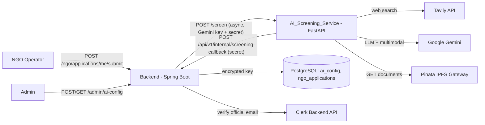
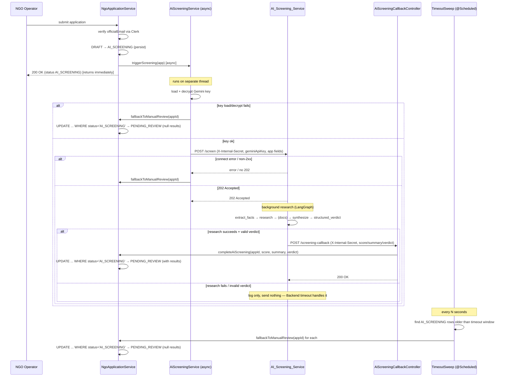
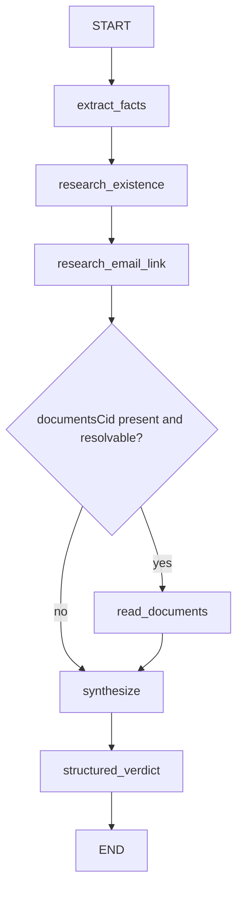

# Design Document

## Overview

This feature delivers AI-powered screening of NGO applications across two codebases:

1. A **NEW** standalone Python service (`AI_Screening_Service`) at `ai-screening/`, built with FastAPI + LangGraph. It is stateless: it performs research for one screening request and forgets everything when the run ends.
2. **MODIFICATIONS** to the existing Java Spring Boot Backend at `backend/`, which owns the NGO application status machine, persistence, admin APIs, and the encrypted Gemini key.

The integration uses an **asynchronous webhook-callback** pattern. When an NGO submits an application, the Backend transitions it to `AI_SCREENING`, fires a fire-and-forget HTTP `POST /screen` at the AI service (carrying the decrypted Gemini key and a shared secret), and returns to the operator immediately. The AI service answers `202 Accepted`, runs a LangGraph research graph in the background, then `POST`s the result back to the Backend's internal callback endpoint. The callback handler stores the score/summary/verdict and advances the application to `PENDING_REVIEW`.

The screening is **best-effort**. Any failure — AI service unreachable, invalid Gemini key, research exception, timeout, malformed verdict — must still let the application reach `PENDING_REVIEW` so a human admin can review it manually. A flaky AI must never strand a legitimate NGO. Two Backend mechanisms guarantee this: an immediate trigger-failure fallback, and a scheduled timeout sweep that advances stale `AI_SCREENING` rows.

This design replaces the current synchronous fake advancement in `NgoApplicationService.submitApplication()` and the no-op stub `AiScreeningService.triggerScreening()`.

### Key Design Decisions

| Decision | Rationale |
|---|---|
| Async webhook callback (not polling) | The Backend never blocks on long-running LLM research; the operator gets an immediate response. |
| Scheduled timeout sweep (not per-app delayed task) | A `@Scheduled` sweep that finds stale `AI_SCREENING` rows is simpler, survives Backend restarts, and naturally handles the case where the trigger thread died. A per-app in-memory delayed task would be lost on restart. |
| Atomic conditional update (`UPDATE ... WHERE status='AI_SCREENING'`) | The callback and the timeout sweep can race. A conditional update with a rows-affected check guarantees exactly one writer wins, satisfying idempotency without distributed locks. |
| Separate `SecurityFilterChain` for `/api/v1/internal/**` | The Clerk JWT converter must not run on machine-to-machine paths. A higher-precedence filter chain matched to the internal path uses shared-secret auth instead of JWT. |
| AES-GCM symmetric encryption, key from env | Java's built-in `javax.crypto` provides authenticated encryption (confidentiality + integrity). The key never lives in the database. Ciphertext + IV are stored together. |
| Only the Gemini key is per-request/admin-swappable | The Gemini key is operational config an admin rotates without redeploy, so it is encrypted in the Backend and forwarded per request. The **Tavily key is platform infrastructure** — a static env var on the AI service, never admin-managed and never sent over the wire. |
| Mutual shared secret (`X-Internal-Secret`) | The same header authenticates both directions: Backend→AI (`/screen`) and AI→Backend (`/screening-callback`). |

### Cross-Codebase Verification Note

The Java Backend changes are authored **and verified** in this environment (Maven build + tests). The Python `AI_Screening_Service` can be **authored but not run or verified here** — there is no Python toolchain in this workspace. All Python verification (uv sync, pytest, uvicorn smoke run) happens on the user's machine. The design therefore specifies exact commands and expected behavior for the Python side so it can be validated locally.

## Architecture

### System Context



### Async Screening Sequence



The conditional update (`WHERE status='AI_SCREENING'`) is the single concurrency primitive that makes the callback, the trigger-failure fallback, and the timeout sweep mutually exclusive: whichever runs first flips the status, and every later writer finds zero matching rows and becomes a no-op.

### Component Responsibilities

**Backend (`backend/`)**
- `NgoApplicationService` — orchestrates submit; triggers async screening; exposes `completeAiScreening` and `fallbackToManualReview` as atomic conditional transitions.
- `AiScreeningService` (reworked) — real async outbound `POST /screen` via `java.net.http.HttpClient`; on any delivery failure calls `fallbackToManualReview`.
- `AiScreeningCallbackController` — `POST /api/v1/internal/screening-callback`; shared-secret auth; delegates to `completeAiScreening`.
- `AiConfigController` — `POST`/`GET /api/v1/admin/ai-config`; ADMIN-only.
- `AiConfigService` + `KeyEncryptionService` — AES-GCM encrypt/decrypt; masking.
- `AiConfig` entity + `AiConfigRepository` + Flyway `V3` migration.
- `ScreeningTimeoutSweep` — `@Scheduled` job advancing stale `AI_SCREENING` rows.
- `InternalApiSecurityConfig` — separate high-precedence `SecurityFilterChain` for `/api/v1/internal/**`.

**AI Service (`ai-screening/`)**
- `main.py` (FastAPI) — `POST /screen` (202 + `BackgroundTasks`), shared-secret dependency, health check.
- `graph.py` — LangGraph `Research_Graph` definition and node functions.
- `models.py` — Pydantic models (request, structured verdict, callback payload, graph state).
- `ipfs.py` — `Document_Fetch` via httpx (single-file vs directory, caps and guards).
- `callback.py` — httpx callback client to the Backend.
- `config.py` — env-driven settings.

## Components and Interfaces

### Backend — `NgoApplicationService` (modified)

Remove the fake synchronous advancement. After persisting `AI_SCREENING`, hand off to the async trigger and return.

```java
@Transactional
public ApplicationResponse submitApplication(String clerkId) {
    User user = userService.getAuthenticatedUserWithWallet(clerkId);
    NgoApplication application = getActiveApplication(user.getId());
    assertStatus(application, ApplicationStatus.DRAFT, "submit");

    boolean emailVerified = clerkEmailVerificationService
            .isVerifiedEmailForUser(user.getClerkId(), application.getOfficialEmail());
    if (!emailVerified) {
        throw new ApiException(HttpStatus.BAD_REQUEST, "EMAIL_NOT_VERIFIED", "...");
    }

    application.setStatus(ApplicationStatus.AI_SCREENING);
    application = applicationRepository.save(application);
    // NOTE: no immediate PENDING_REVIEW advancement anymore.

    aiScreeningService.triggerScreening(toScreeningRequest(application)); // async, returns immediately
    return toApplicationResponse(application);
}
```

New atomic transition methods. Both use a conditional update so callback/sweep/trigger-failure cannot double-apply:

```java
/** Callback success path: store results and advance, only if still AI_SCREENING. Returns true if this call won. */
@Transactional
public boolean completeAiScreening(UUID appId, BigDecimal score, String summary, String verdict) {
    int updated = applicationRepository.completeScreening(
        appId, ApplicationStatus.AI_SCREENING, ApplicationStatus.PENDING_REVIEW, score, summary, verdict);
    return updated == 1;
}

/** Fallback path (trigger failure, key failure, timeout): advance with null results, only if still AI_SCREENING. */
@Transactional
public boolean fallbackToManualReview(UUID appId) {
    int updated = applicationRepository.fallbackToPendingReview(
        appId, ApplicationStatus.AI_SCREENING, ApplicationStatus.PENDING_REVIEW);
    return updated == 1;
}
```

`existsById` is checked first in the callback controller path to distinguish "unknown application" (404) from "already advanced" (200 idempotent no-op).

### Backend — `NgoApplicationRepository` (new methods)

```java
@Modifying
@Query("""
    UPDATE NgoApplication a
       SET a.status = :toStatus,
           a.aiConfidenceScore = :score,
           a.aiResearchSummary = :summary,
           a.aiVerdict = :verdict
     WHERE a.id = :id AND a.status = :fromStatus
""")
int completeScreening(UUID id, ApplicationStatus fromStatus, ApplicationStatus toStatus,
                      BigDecimal score, String summary, String verdict);

@Modifying
@Query("""
    UPDATE NgoApplication a SET a.status = :toStatus
     WHERE a.id = :id AND a.status = :fromStatus
""")
int fallbackToPendingReview(UUID id, ApplicationStatus fromStatus, ApplicationStatus toStatus);

/** Timeout sweep: stale rows still in AI_SCREENING past the window. */
@Query("SELECT a.id FROM NgoApplication a WHERE a.status = :status AND a.updatedAt < :threshold")
List<UUID> findStaleScreeningIds(ApplicationStatus status, OffsetDateTime threshold);
```

`@Modifying` queries bypass the JPA dirty-checking / optimistic flow and execute a single SQL `UPDATE` whose rows-affected count is the race winner signal. The `@PreUpdate` timestamp hook does not fire on bulk updates, so the sweep query relies on `updatedAt` set when the row entered `AI_SCREENING`.

### Backend — `AiScreeningService` (reworked)

```java
@Service
@RequiredArgsConstructor
@Slf4j
public class AiScreeningService {

    private final AiConfigService aiConfigService;
    private final NgoApplicationService ngoApplicationService; // for fallback
    private final AiScreeningProperties properties;
    private final ObjectMapper objectMapper;

    private static final HttpClient HTTP_CLIENT = HttpClient.newBuilder()
            .connectTimeout(Duration.ofSeconds(10)).build();

    @Async
    public void triggerScreening(ScreeningRequest request) {
        String geminiKey;
        try {
            geminiKey = aiConfigService.getDecryptedKey()    // throws if absent/undecryptable
                    .orElseThrow(() -> new IllegalStateException("No Gemini key configured"));
        } catch (Exception e) {
            log.warn("Gemini key unavailable for app {} — falling back to manual review", request.applicationId());
            ngoApplicationService.fallbackToManualReview(request.applicationId());
            return;
        }

        try {
            String body = objectMapper.writeValueAsString(request.withGeminiKey(geminiKey));
            HttpRequest httpRequest = HttpRequest.newBuilder()
                    .uri(URI.create(properties.getBaseUrl() + "/screen"))
                    .timeout(Duration.ofSeconds(10))
                    .header("Content-Type", "application/json")
                    .header("X-Internal-Secret", properties.getSharedSecret())
                    .POST(HttpRequest.BodyPublishers.ofString(body))
                    .build();
            HttpResponse<String> resp = HTTP_CLIENT.send(httpRequest, HttpResponse.BodyHandlers.ofString());
            if (resp.statusCode() < 200 || resp.statusCode() >= 300) {
                log.warn("AI /screen returned {} for app {} — fallback", resp.statusCode(), request.applicationId());
                ngoApplicationService.fallbackToManualReview(request.applicationId());
            }
        } catch (Exception e) {
            log.warn("AI /screen delivery failed for app {} — fallback: {}", request.applicationId(), e.getMessage());
            ngoApplicationService.fallbackToManualReview(request.applicationId());
        }
    }
}
```

The `geminiKey` value is **never logged**. Requires `@EnableAsync` (add to a config class; `@EnableScheduling` is already present on `BackendApplication`).

### Backend — `AiScreeningCallbackController` (new)

```java
@RestController
@RequestMapping("/api/v1/internal")
@RequiredArgsConstructor
@Slf4j
public class AiScreeningCallbackController {

    private final NgoApplicationService ngoApplicationService;

    @PostMapping("/screening-callback")
    public ResponseEntity<Void> handleCallback(@Valid @RequestBody ScreeningCallbackRequest body) {
        // Shared-secret auth is enforced by InternalSecretFilter before this runs.
        if (!ngoApplicationService.applicationExists(body.applicationId())) {
            return ResponseEntity.notFound().build(); // 404, no mutation
        }
        // Idempotent: returns true only if this call moved AI_SCREENING → PENDING_REVIEW.
        ngoApplicationService.completeAiScreening(
            body.applicationId(), body.confidenceScore(), body.researchSummary(), body.verdict());
        return ResponseEntity.ok().build(); // 200 whether we won or it was already advanced
    }
}
```

Bean-validation on `ScreeningCallbackRequest` enforces verdict ∈ {PASS, FAIL} and score ∈ [0.00, 100.00]; a violation yields `400 VALIDATION_ERROR` via the existing `GlobalExceptionHandler`.

### Backend — Internal API security (new `SecurityFilterChain`)

The Clerk JWT converter must not run on `/api/v1/internal/**`. Define a separate, higher-precedence chain matched to that path that uses a shared-secret filter and permits the request only when the secret matches.

```java
@Configuration
@EnableWebSecurity
@RequiredArgsConstructor
public class InternalApiSecurityConfig {

    private final AiScreeningProperties properties;

    @Bean
    @Order(1) // higher precedence than the main chain
    public SecurityFilterChain internalFilterChain(HttpSecurity http) throws Exception {
        http
            .securityMatcher("/api/v1/internal/**")
            .csrf(csrf -> csrf.disable())
            .sessionManagement(s -> s.sessionCreationPolicy(SessionCreationPolicy.STATELESS))
            .authorizeHttpRequests(auth -> auth.anyRequest().permitAll()) // secret checked in filter
            .addFilterBefore(new InternalSecretFilter(properties.getSharedSecret()),
                             UsernamePasswordAuthenticationFilter.class);
        // NOTE: no .oauth2ResourceServer here — Clerk JWT never runs on this chain.
        return http.build();
    }
}
```

`InternalSecretFilter` reads `X-Internal-Secret`, compares with `MessageDigest.isEqual(...)` (constant-time) against the configured secret, and returns `401` (writing an `ErrorResponse`-shaped body) without calling the rest of the chain when it does not match. The existing `SecurityConfig` chain is annotated `@Order(2)` (or left default, which is lower precedence) and continues to cover everything else with Clerk JWT.

### Backend — `AiConfigController` (new, ADMIN-only)

```java
@RestController
@RequestMapping("/api/v1/admin/ai-config")
@RequiredArgsConstructor
@PreAuthorize("hasRole('ADMIN')")
public class AiConfigController {

    private final AiConfigService aiConfigService;

    @PostMapping
    public ResponseEntity<AiConfigStatusResponse> setKey(
            @AuthenticationPrincipal Jwt jwt, @Valid @RequestBody SetAiConfigRequest request) {
        aiConfigService.setKey(request.geminiApiKey(), jwt.getSubject());
        return ResponseEntity.ok(aiConfigService.getStatus());   // masked metadata, never raw key
    }

    @GetMapping
    public ResponseEntity<AiConfigStatusResponse> getStatus() {
        return ResponseEntity.ok(aiConfigService.getStatus());
    }
}
```

### Backend — `KeyEncryptionService` (new)

AES-GCM with a 256-bit key from `ai-config.encryption-key` (base64 in env). Stores `IV || ciphertext` base64-encoded so a single column round-trips.

```java
public interface KeyEncryptionService {
    /** Encrypt plaintext → base64(iv || ciphertext+tag). New random 12-byte IV each call. */
    String encrypt(String plaintext);
    /** Inverse of encrypt. Throws on tamper/wrong key (GCM auth tag failure). */
    String decrypt(String stored);
    /** Mask for display: keep first 4 + last 3 chars, replace the middle with a fixed mask. */
    String mask(String plaintext);
}
```

Masking rule: for a key longer than `prefix+suffix` (4+3), show `prefix + "..." + suffix` (e.g. `AIza...3f9`); for shorter keys, the entire body is masked so no more than the allowed prefix/suffix characters of the original ever appear.

### AI Service — FastAPI `POST /screen`

```python
@app.post("/screen", status_code=202)
async def screen(
    req: ScreenRequest,
    background_tasks: BackgroundTasks,
    _: None = Depends(verify_internal_secret),  # 401 if X-Internal-Secret mismatches
):
    background_tasks.add_task(run_screening, req)  # research happens AFTER 202 is returned
    return {"status": "accepted", "applicationId": req.application_id}
```

- `verify_internal_secret` compares the `X-Internal-Secret` header with `SHARED_SECRET` using `hmac.compare_digest` (constant-time); raises `HTTPException(401)` on mismatch.
- FastAPI returns `422` automatically when required body fields are missing/invalid (Requirement 2.4).
- `run_screening` builds the graph, runs it, and — only on success with a valid verdict — calls the callback client. On any failure it logs and returns without calling back.

### AI Service — `Research_Graph` (LangGraph)

Nodes and edges:



| Node | Responsibility |
|---|---|
| `extract_facts` | Normalize application fields (orgName, registrationNumber, officialEmail, email domain) into the graph state. |
| `research_existence` | Tavily web search for a real registered NGO matching orgName + registrationNumber; record findings. |
| `research_email_link` | Tavily search for the org's web presence; assess whether the officialEmail domain matches it. |
| `read_documents` | (conditional) Fetch documents via IPFS, read with Gemini multimodal, cross-reference orgName/registrationNumber/email domain. Frames findings as "consistent with the application"; never "authentic"/"genuine". |
| `synthesize` | Combine existence + email + (optional) document findings into a Research_Summary. |
| `structured_verdict` | Use Gemini structured output to emit `{confidenceScore, verdict}`; validated against the Pydantic schema. |

The conditional edge skips `read_documents` when `documentsCid` is null/blank or the fetch yields nothing; `documents_evaluated=false` is recorded and never drives a `FAIL` on its own (Requirements 4.5, 4.6).

### AI Service — callback client

```python
async def send_callback(payload: CallbackPayload) -> None:
    if not settings.backend_callback_url:        # Req 15.6: unresolved target → do not send
        logger.error("No callback URL configured; dropping result for %s", payload.application_id)
        return
    async with httpx.AsyncClient(timeout=10) as client:
        await client.post(
            settings.backend_callback_url,
            headers={"X-Internal-Secret": settings.shared_secret},
            json=payload.model_dump(by_alias=True),
        )
```

## Data Models

### `ai_config` table (Flyway `V3__ai_config.sql`)

Naming continues the existing convention (`V1__...`, `V2__...`). The single-active-record rule (Requirement 14.3/14.4) is enforced by a unique partial index on a constant discriminator column.

```sql
-- V3__ai_config.sql
CREATE TABLE ai_config (
    id              UUID PRIMARY KEY DEFAULT gen_random_uuid(),
    -- AES-GCM: base64(iv || ciphertext+tag). Never plaintext.
    encrypted_key   TEXT NOT NULL,
    set_by          VARCHAR(255) NOT NULL,   -- admin Clerk subject id
    set_at          TIMESTAMPTZ NOT NULL DEFAULT now(),
    is_active       BOOLEAN NOT NULL DEFAULT true
);

-- At most one active record (current key).
CREATE UNIQUE INDEX uq_ai_config_active ON ai_config(is_active) WHERE is_active = true;
```

"Replace" semantics (Requirement 10.3): the service updates the existing active row's `encrypted_key`, `set_by`, `set_at` in place (single active row), so no second active row is ever inserted.

### `AiConfig` entity

```java
@Entity @Table(name = "ai_config")
@Getter @Setter @NoArgsConstructor @AllArgsConstructor @Builder
public class AiConfig {
    @Id @GeneratedValue(strategy = GenerationType.UUID) private UUID id;
    @Column(name = "encrypted_key", nullable = false, columnDefinition = "TEXT") private String encryptedKey;
    @Column(name = "set_by", nullable = false) private String setBy;
    @Column(name = "set_at", nullable = false) private OffsetDateTime setAt;
    @Column(name = "is_active", nullable = false) @Builder.Default private boolean active = true;
}
```

### Shared JSON contract (Requirement 15.1)

**Screening request — Backend → AI `POST /screen`**

```json
{
  "applicationId": "550e8400-e29b-41d4-a716-446655440000",
  "orgName": "Hope Foundation",
  "registrationNumber": "REG-12345",
  "description": "We provide clean water...",
  "officialEmail": "director@hopefoundation.org",
  "documentsCid": "bafybeih...",
  "geminiApiKey": "AIza..."
}
```
`documentsCid` is nullable. `geminiApiKey` is present only on this request and is never persisted by the AI service.

**Screening result — AI → Backend `POST /api/v1/internal/screening-callback`**

```json
{
  "applicationId": "550e8400-e29b-41d4-a716-446655440000",
  "confidenceScore": 87.50,
  "researchSummary": "Organization existence: ... Email association: ... Documents: consistent with the application ...",
  "verdict": "PASS"
}
```

### Backend DTOs

```java
public record ScreeningRequest(UUID applicationId, String orgName, String registrationNumber,
                               String description, String officialEmail, String documentsCid,
                               String geminiApiKey) {
    public ScreeningRequest withGeminiKey(String key) { /* copy with key set */ }
}

public record ScreeningCallbackRequest(
    @NotNull UUID applicationId,
    @NotNull @DecimalMin("0.00") @DecimalMax("100.00") @Digits(integer = 3, fraction = 2) BigDecimal confidenceScore,
    @NotBlank String researchSummary,
    @NotNull @Pattern(regexp = "PASS|FAIL") String verdict) {}

public record SetAiConfigRequest(@NotBlank String geminiApiKey) {}

public record AiConfigStatusResponse(boolean configured, String maskedKey, String setBy, OffsetDateTime setAt) {}
```

### AI Service — Pydantic models

```python
class ScreenRequest(BaseModel):
    application_id: str = Field(alias="applicationId")
    org_name: str = Field(alias="orgName")
    registration_number: str = Field(alias="registrationNumber")
    description: str
    official_email: str = Field(alias="officialEmail")
    documents_cid: str | None = Field(default=None, alias="documentsCid")
    gemini_api_key: str = Field(alias="geminiApiKey")

class StructuredVerdict(BaseModel):
    # Gemini structured output target. ge/le enforce the valid range; bad values raise ValidationError.
    confidence_score: float = Field(ge=0.0, le=100.0)
    verdict: Literal["PASS", "FAIL"]

class CallbackPayload(BaseModel):
    application_id: str = Field(alias="applicationId")
    confidence_score: float = Field(ge=0.0, le=100.0, alias="confidenceScore")
    research_summary: str = Field(alias="researchSummary")
    verdict: Literal["PASS", "FAIL"]
```

`confidence_score` is rounded to two decimals before building `CallbackPayload` to honor the `DECIMAL(5,2)` contract (Requirement 5.2).

### LangGraph state

```python
class ResearchState(TypedDict, total=False):
    request: ScreenRequest
    email_domain: str
    existence_findings: str
    email_link_findings: str
    documents_evaluated: bool
    document_findings: str
    research_summary: str
    verdict: StructuredVerdict   # set by structured_verdict node
```

### AI Service configuration (env)

| Variable | Purpose | Per-request? |
|---|---|---|
| `BACKEND_CALLBACK_URL` | Where to POST results | infra |
| `SHARED_SECRET` | Mutual `X-Internal-Secret` value | infra |
| `IPFS_GATEWAY_URL` | Document fetch base (`https://gateway.pinata.cloud/ipfs/`) | infra |
| `MAX_DOCUMENT_FILES` | Cap on files fetched from a directory CID | infra |
| `MAX_DOCUMENT_BYTES` | Cap on bytes per file | infra |
| `GEMINI_MODEL` | Model id (e.g. `gemini-2.0-flash`) | infra |
| `TAVILY_API_KEY` | **Platform infra** Tavily key — NOT admin-swappable, never sent over the wire | infra |
| Gemini API key | Arrives in each `/screen` request body; used only for that run, then discarded | **per-request** |

### Backend configuration (new properties)

```properties
ai-screening.base-url=${AI_SCREENING_BASE_URL:http://localhost:8000}
ai-screening.shared-secret=${AI_SCREENING_SHARED_SECRET:}
ai-screening.callback-timeout-seconds=${AI_SCREENING_CALLBACK_TIMEOUT_SECONDS:120}
ai-config.encryption-key=${AI_CONFIG_ENCRYPTION_KEY:}
```

Bound via an `@ConfigurationProperties(prefix = "ai-screening")` `AiScreeningProperties` class (mirroring `IndexerProperties`); the encryption key is read into `KeyEncryptionService`.

## Correctness Properties

*A property is a characteristic or behavior that should hold true across all valid executions of a system — essentially, a formal statement about what the system should do. Properties serve as the bridge between human-readable specifications and machine-verifiable correctness guarantees.*

The following properties were derived from the acceptance-criteria prework. Many criteria are wiring/config/UI-style checks (external HTTP calls, Spring Security wiring, logging discipline, Flyway setup) and are covered by example, edge-case, integration, or smoke tests in the Testing Strategy rather than as properties. The properties below capture the genuinely universal behaviors.

### Property 1: Gemini key encryption round-trip

*For any* non-blank Gemini API key string, encrypting it with the Encryption_Key and then decrypting the stored value recovers the exact original key, and the stored ciphertext is never equal to the plaintext key.

**Validates: Requirements 10.1, 10.6, 12.1**

### Property 2: Masking never reveals the raw key

*For any* Gemini API key longer than the configured prefix + suffix length, the Masked_Key preserves at most the leading prefix and trailing suffix characters of the original, replaces all intervening characters with the fixed mask, and the masked output does not contain the full raw key as a substring.

**Validates: Requirements 10.5, 11.2, 11.3, 12.3**

### Property 3: Emitted verdict is always well-formed

*For any* Screening_Result the AI_Screening_Service emits to the callback, the Confidence_Score is a number within the inclusive range `0.00` to `100.00` with at most two decimal places, and the Verdict is exactly one of `PASS` or `FAIL`.

**Validates: Requirements 3.4, 3.5, 5.2, 5.3**

### Property 4: Invalid or failed runs send nothing

*For any* structured model output whose Verdict is not `PASS`/`FAIL` or whose Confidence_Score falls outside `0.00`–`100.00`, and *for any* research run that raises an error (internal error, invalid Gemini key, research exception), the AI_Screening_Service treats the run as failed and sends no Screening_Result to the callback.

**Validates: Requirements 5.4, 7.4**

### Property 5: Directory document fetch respects caps

*For any* directory Documents_Cid resolving to a listing of files with arbitrary sizes, the Document_Fetch retrieves at most Max_Document_Files files and reads at most Max_Document_Bytes bytes from any single file.

**Validates: Requirements 4.7**

### Property 6: Screening advancement is exactly-once and idempotent

*For any* NGO_Application and *any* interleaving of result callbacks, trigger-failure fallbacks, and timeout-sweep fallbacks, the transition out of `AI_SCREENING` to `PENDING_REVIEW` is applied at most once: the first operation that runs while the application is in `AI_SCREENING` wins (storing its results, or null results for a fallback), every subsequent operation leaves the stored status and AI result fields unchanged, and no callback ever transitions the application to `APPROVED` or `REJECTED`.

**Validates: Requirements 6.1, 6.2, 6.5, 7.5, 9.1, 9.2, 9.3**

### Property 7: Internal endpoints reject every non-matching secret

*For any* string value supplied in the `X-Internal-Secret` header that is not equal to the configured Shared_Secret (including absent, empty, and near-match values), the receiving endpoint returns HTTP 401 and performs no side effect — the Backend Screening_Callback_Endpoint modifies no NGO_Application, and the AI_Screening_Service Screen_Endpoint begins no research.

**Validates: Requirements 2.3, 8.2**

### Property 8: Application identifier is preserved end-to-end

*For any* screening request, the application identifier carried in the Screening_Result sent to the callback equals the application identifier from the originating screening request.

**Validates: Requirements 15.5**

## Error Handling

The central error-handling principle is **fail-open to manual review**: any screening failure must still let the application reach `PENDING_REVIEW`. No failure mode may strand an application in `AI_SCREENING` indefinitely.

### Backend error handling

| Failure | Detection | Handling |
|---|---|---|
| No Gemini key / decrypt fails at trigger time | `AiConfigService.getDecryptedKey()` empty or throws | `fallbackToManualReview(appId)` → PENDING_REVIEW, null results (Req 7.3) |
| AI `/screen` unreachable (connect/DNS/timeout) | `HttpClient.send` throws | `fallbackToManualReview(appId)` (Req 7.1) |
| AI `/screen` returns non-2xx | status code check | `fallbackToManualReview(appId)` (Req 7.1) |
| No callback within window | `ScreeningTimeoutSweep` finds stale `AI_SCREENING` rows | `fallbackToManualReview(appId)` per row (Req 7.2) |
| Callback for unknown appId | `applicationExists` false | `404`, no mutation (Req 6.4) |
| Callback with malformed body (bad verdict/score) | Bean Validation on `ScreeningCallbackRequest` | `400 VALIDATION_ERROR` via `GlobalExceptionHandler` |
| Wrong/missing internal secret | `InternalSecretFilter` constant-time compare fails | `401`, chain short-circuited (Req 8.2) |
| Duplicate callback / callback racing the sweep | conditional `UPDATE ... WHERE status='AI_SCREENING'` returns 0 rows | `200` idempotent no-op (Req 9.1, 9.2, 7.5) |
| Blank key on set | `@NotBlank` on `SetAiConfigRequest` | `400 VALIDATION_ERROR`, record unchanged (Req 10.4) |
| Second active `ai_config` row | unique partial index `uq_ai_config_active` | `DataIntegrityViolationException` → existing record preserved (Req 14.4); service uses in-place update so this is defense-in-depth |
| Non-admin / no JWT on ai-config | main `SecurityFilterChain` + `@PreAuthorize` | `401` / `403` (Req 13.1, 13.2) |

The Backend never surfaces the Gemini key in any error message, log line, or response body (Req 12.2, 12.3). `ApiException` + the existing `GlobalExceptionHandler` produce the standard `ErrorResponse` shape.

### AI service error handling

| Failure | Handling |
|---|---|
| Missing/wrong `X-Internal-Secret` on `/screen` | `401`, no research (Req 2.3) |
| Missing required request field | `422` from Pydantic, no research (Req 2.4) |
| `documentsCid` null/blank | accept, skip document step, web-only research (Req 2.5, 4.5) |
| IPFS CID unresolvable (404), directory empty, or unreadable | record `documents_evaluated=false`, continue, still produce a result; never `FAIL` solely for this (Req 4.5, 4.6) |
| Directory exceeds caps | stop at Max_Document_Files / Max_Document_Bytes (Req 4.7) |
| Gemini error / invalid key / research exception | log, send nothing — rely on Backend timeout fallback (Req 7.4) |
| Structured output fails schema validation (bad verdict/range) | treat run as failed, send nothing (Req 5.4) |
| Callback URL unresolved | do not send (Req 15.6) |
| Callback POST fails | log; Backend timeout fallback covers the application |

The AI service holds the Gemini key only as a local variable for the duration of one run and persists nothing (Req 12.5, 12.6).

## Testing Strategy

This feature has genuine universal properties (encryption round-trip, masking, verdict bounds, idempotency, fetch caps), so **property-based testing applies** alongside example, edge-case, integration, and smoke tests. Where behavior is external-service wiring, Spring Security configuration, logging discipline, or one-time setup, PBT is not appropriate and the alternatives below are used.

### Backend (Java) — verified in this environment

Tooling already available: JUnit 5, Spring Security Test, MockMvc, Mockito, Testcontainers (Postgres), H2, and **jqwik 1.9.1** for property tests.

**Property tests (jqwik, ≥ 100 iterations each).** Each test is tagged `// Feature: ai-screening-service, Property N: <text>`:
- **Property 1** — `KeyEncryptionService` round-trip: `@Property` over arbitrary non-blank strings; assert `decrypt(encrypt(k)).equals(k)` and `encrypt(k) != k`.
- **Property 2** — masking: `@Property` over arbitrary keys; assert masked output excludes the raw key and keeps only prefix/suffix originals.
- **Property 6** — idempotency/exactly-once: `@Property` generating arbitrary sequences of `completeAiScreening` / `fallbackToManualReview` / sweep operations against a seeded `AI_SCREENING` application (Testcontainers Postgres for the real conditional UPDATE); assert exactly one transition occurs, later ops are no-ops, and status is never APPROVED/REJECTED.
- **Property 7** (Backend side) — callback auth: `@Property` over arbitrary header values ≠ secret via MockMvc; assert `401` and no application mutation.

**Example / MockMvc tests:**
- Trigger sends well-formed `/screen` request with all app fields, decrypted key, and secret header (mock `HttpClient`) — Req 1.1, 1.3, 1.4, 12.4.
- Submit returns immediately with `AI_SCREENING` and no synchronous advancement — Req 1.2, 1.5, 1.6.
- Trigger fallback on throw / non-2xx / key failure → PENDING_REVIEW null results — Req 7.1, 7.3.
- Timeout sweep advances a stale row → PENDING_REVIEW null results — Req 7.2.
- Callback happy path → 200 + fields stored — Req 6.1, 6.3.
- ai-config set/get: set_by/set_at recorded, replace semantics, masked GET, no-record GET — Req 10.2, 10.3, 11.1, 11.4.
- Authorization: no JWT → 401, non-admin → 403, admin → 2xx — Req 13.1–13.3.
- Internal path reachable without JWT when secret valid — Req 8.1, 8.4.

**Edge-case tests:** unknown appId → 404 (6.4); blank key → 400 (10.4); second active `ai_config` row rejected (14.3, 14.4).

**Smoke/integration tests:** Flyway `V3` migration creates `ai_config` with required columns on Testcontainers Postgres (14.1, 14.2); `AiScreeningProperties` binds the four config properties (15.4). Code review confirms constant-time comparison (8.3) and that the key is never logged (12.2).

### AI service (Python) — authored here, verified on the user's machine

This workspace has no Python toolchain, so the AI service is written but **not executed or verified here**. On the user's machine, with `uv` (pyproject.toml):

```
uv sync
uv run pytest
uv run uvicorn ai_screening.main:app --port 8000   # manual smoke
```

Tooling: **pytest**, **hypothesis** (property tests), **respx**/`httpx` mock transport for HTTP, and FastAPI `TestClient`. Gemini and Tavily are mocked — no live LLM/search calls in tests.

**Property tests (hypothesis, ≥ 100 examples), tagged `# Feature: ai-screening-service, Property N: <text>`:**
- **Property 3** — emitted verdict well-formed: generate valid raw scores/verdicts; assert `CallbackPayload` score ∈ [0,100], ≤2 decimals, verdict ∈ {PASS, FAIL}.
- **Property 4** — invalid/failed runs send nothing: generate out-of-range scores and non-PASS/FAIL verdicts (and forced node exceptions); assert `StructuredVerdict` validation rejects them and the callback client is never invoked.
- **Property 5** — directory fetch caps: generate directory listings of N files with random sizes; assert files fetched ≤ `MAX_DOCUMENT_FILES` and bytes per file ≤ `MAX_DOCUMENT_BYTES`.
- **Property 7** (AI side) — `/screen` secret: generate arbitrary header values ≠ secret via `TestClient`; assert `401` and `run_screening` never scheduled.
- **Property 8** — appId preservation: for any request appId, run the graph with mocked Gemini/Tavily and assert the callback payload's `applicationId` equals the request's.

**Example / unit tests:**
- `/screen` returns 202 and schedules background research (2.1, 2.2).
- Missing field → 422 (2.4); missing/null `documentsCid` accepted, web-only (2.5).
- Research graph node wiring with mocked Tavily/Gemini: existence + email-link searches invoked (3.1, 3.2, integration-style); summary populated (3.3); document cross-reference framed as "consistent", not "authentic" (4.2, 4.3).
- IPFS fetch: single-file, directory, unresolvable (404), unreadable → `documents_evaluated=false`, run still completes (4.1, 4.5, 4.6).
- Callback client includes all fields and `X-Internal-Secret` (5.1, 5.5); unresolved URL → no send (15.6).
- Config loads from env (15.3).

**Smoke / review items:** independent deployability via `pyproject.toml` (15.2); statelessness — key is a local variable, no persistence layer (12.5, 12.6); document-authenticity exclusion present in prompts (4.4).

### Property test configuration

- Each correctness property is implemented by a **single** property-based test (jqwik on the Backend, hypothesis on the AI service).
- Minimum **100 iterations** per property test.
- Each property test references its design property via the tag `Feature: ai-screening-service, Property {number}: {property_text}`.
- Unit/example tests cover concrete scenarios, edge cases, and external-service wiring; property tests cover universal behavior. Both are required for full coverage.
