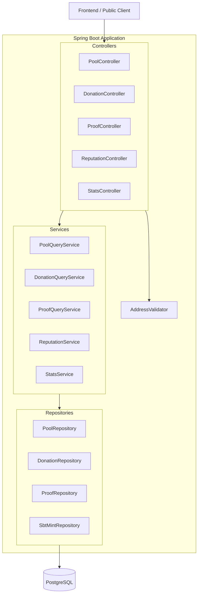

# Design Document: Core Query / Read APIs

## Overview

This design covers the read-only REST API layer for the Livana backend. The event indexer already populates Postgres with on-chain data (pools, donations, proofs, SBT mints). This feature adds the controllers, services, DTOs, and custom repository queries needed to serve that data to the frontend.

All endpoints return JSON. Public endpoints (pool browsing, leaderboards, stats, reputation) require no authentication. Donor history requires a valid Clerk JWT. Pending proofs require ADMIN role.

The design follows the existing patterns: `@RestController` → service → repository, Lombok for boilerplate, `ApiException` + `GlobalExceptionHandler` for errors, and Java records for DTOs.

## Architecture



All request flows are:
1. Controller validates path/query params (address format via `AddressValidator`, pagination caps)
2. Controller delegates to service
3. Service calls repository (using custom `@Query` methods for aggregations)
4. Service maps entity → DTO
5. Controller returns `ResponseEntity` with DTO

## Components and Interfaces

### AddressValidator (Shared Utility)

A static utility class in `com.livana.backend.common.validation` that validates and normalizes Ethereum addresses.

```java
public final class AddressValidator {
    private static final Pattern ADDRESS_PATTERN = Pattern.compile("^0x[0-9a-fA-F]{40}$");
    
    public static String validateAndNormalize(String address, String paramName) {
        if (address == null || address.isBlank()) {
            throw new ApiException(HttpStatus.BAD_REQUEST, "INVALID_ADDRESS",
                paramName + " must not be empty");
        }
        if (!ADDRESS_PATTERN.matcher(address).matches()) {
            throw new ApiException(HttpStatus.BAD_REQUEST, "INVALID_ADDRESS",
                paramName + " must be a 42-character hex string starting with 0x");
        }
        return address.toLowerCase();
    }
}
```

**Rationale:** A shared utility avoids duplicating regex validation across 5 controllers. The method normalizes mixed-case (EIP-55) addresses to lowercase before DB queries, matching the storage format.

### PoolController

`GET /api/v1/pools` — paginated list with optional `region` and `search` filters  
`GET /api/v1/pools/{address}` — single pool detail

```java
@RestController
@RequestMapping("/api/v1/pools")
@RequiredArgsConstructor
public class PoolController {
    private final PoolQueryService poolQueryService;

    @GetMapping
    public ResponseEntity<Page<PoolSummaryDto>> listPools(
            @RequestParam(required = false) String region,
            @RequestParam(required = false) String search,
            Pageable pageable) { ... }

    @GetMapping("/{address}")
    public ResponseEntity<PoolDetailDto> getPool(@PathVariable String address) { ... }
}
```

### DonationController

`GET /api/v1/donations/pool/{poolAddress}` — donations for a pool (public)  
`GET /api/v1/donations/donor/{donorAddress}` — donations by donor (authenticated)  
`GET /api/v1/donations/leaderboard` — top donors (public)

```java
@RestController
@RequestMapping("/api/v1/donations")
@RequiredArgsConstructor
public class DonationController {
    private final DonationQueryService donationQueryService;

    @GetMapping("/pool/{poolAddress}")
    public ResponseEntity<Page<PoolDonationDto>> donationsByPool(
            @PathVariable String poolAddress, Pageable pageable) { ... }

    @GetMapping("/donor/{donorAddress}")
    public ResponseEntity<Page<DonorDonationDto>> donationsByDonor(
            @PathVariable String donorAddress, Pageable pageable) { ... }

    @GetMapping("/leaderboard")
    public ResponseEntity<List<LeaderboardEntryDto>> leaderboard(
            @RequestParam(defaultValue = "10") int limit) { ... }
}
```

### ProofController

`GET /api/v1/proofs/pool/{poolAddress}` — proofs for a pool (public)  
`GET /api/v1/admin/proofs/pending` — pending proofs (ADMIN only)

```java
@RestController
@RequiredArgsConstructor
public class ProofController {
    private final ProofQueryService proofQueryService;

    @GetMapping("/api/v1/proofs/pool/{poolAddress}")
    public ResponseEntity<Page<ProofDto>> proofsByPool(
            @PathVariable String poolAddress, Pageable pageable) { ... }

    @GetMapping("/api/v1/admin/proofs/pending")
    @PreAuthorize("hasRole('ADMIN')")
    public ResponseEntity<Page<PendingProofDto>> pendingProofs(Pageable pageable) { ... }
}
```

### ReputationController

`GET /api/v1/reputation/{ngoAddress}` — single NGO reputation  
`GET /api/v1/reputation/leaderboard` — NGO leaderboard

```java
@RestController
@RequestMapping("/api/v1/reputation")
@RequiredArgsConstructor
public class ReputationController {
    private final ReputationService reputationService;

    @GetMapping("/{ngoAddress}")
    public ResponseEntity<NgoReputationDto> getReputation(
            @PathVariable String ngoAddress) { ... }

    @GetMapping("/leaderboard")
    public ResponseEntity<List<NgoLeaderboardEntryDto>> leaderboard(
            @RequestParam(defaultValue = "10") int limit) { ... }
}
```

### StatsController

`GET /api/v1/stats` — platform-wide statistics

```java
@RestController
@RequestMapping("/api/v1/stats")
@RequiredArgsConstructor
public class StatsController {
    private final StatsService statsService;

    @GetMapping
    public ResponseEntity<PlatformStatsDto> getStats() { ... }
}
```

### Service Layer

Each service is a `@Service` class with `@RequiredArgsConstructor` for constructor injection of the relevant repository.

| Service | Responsibilities |
|---|---|
| `PoolQueryService` | Paginated pool listing with optional filters, single pool lookup, page size capping |
| `DonationQueryService` | Donations by pool, by donor, leaderboard aggregation |
| `ProofQueryService` | Proofs by pool, pending proofs (admin) |
| `ReputationService` | NGO reputation aggregation, NGO leaderboard |
| `StatsService` | Platform totals from pools table |

### Custom Repository Queries

**DonationRepository** additions:
```java
@Query("""
    SELECT d.donorAddress AS donorAddress,
           SUM(d.amount) AS totalDonated,
           COUNT(d) AS donationCount
    FROM Donation d
    GROUP BY d.donorAddress
    ORDER BY SUM(d.amount) DESC, d.donorAddress ASC
    """)
List<LeaderboardProjection> findDonorLeaderboard(Pageable pageable);
```

**SbtMintRepository** additions:
```java
@Query("""
    SELECT s.ngoAddress AS ngoAddress,
           COUNT(s) AS totalSbts,
           SUM(s.amount) AS totalAmountReleased,
           COUNT(DISTINCT s.poolAddress) AS poolCount
    FROM SbtMint s
    GROUP BY s.ngoAddress
    ORDER BY SUM(s.amount) DESC, s.ngoAddress ASC
    """)
List<NgoLeaderboardProjection> findNgoLeaderboard(Pageable pageable);

@Query("""
    SELECT COUNT(s) AS totalSbts,
           COALESCE(SUM(s.amount), 0) AS totalAmountReleased,
           COUNT(DISTINCT s.poolAddress) AS poolCount
    FROM SbtMint s
    WHERE s.ngoAddress = :ngoAddress
    """)
NgoReputationProjection findReputationByNgoAddress(@Param("ngoAddress") String ngoAddress);
```

**PoolRepository** additions:
```java
@Query("""
    SELECT COALESCE(SUM(p.totalDonated), 0) AS totalDonated,
           COALESCE(SUM(p.totalReleased), 0) AS totalReleased,
           COUNT(CASE WHEN p.isPaused = false THEN 1 END) AS activePoolsCount,
           COUNT(DISTINCT p.creatorAddress) AS verifiedNgosCount
    FROM Pool p
    """)
PlatformStatsProjection findPlatformStats();

Page<Pool> findByRegionIgnoreCase(String region, Pageable pageable);

@Query("""
    SELECT p FROM Pool p
    WHERE LOWER(p.title) LIKE LOWER(CONCAT('%', :search, '%'))
    ORDER BY p.deployedAt DESC
    """)
Page<Pool> findByTitleContainingIgnoreCase(@Param("search") String search, Pageable pageable);

@Query("""
    SELECT p FROM Pool p
    WHERE LOWER(p.region) = LOWER(:region)
      AND LOWER(p.title) LIKE LOWER(CONCAT('%', :search, '%'))
    """)
Page<Pool> findByRegionAndTitleContaining(
    @Param("region") String region,
    @Param("search") String search,
    Pageable pageable);
```

### Pagination Strategy

- All paginated endpoints use Spring's `Pageable` with `@PageableDefault(size = 20, sort = "deployedAt", direction = DESC)`
- Services cap page size at 100: `PageRequest.of(pageable.getPageNumber(), Math.min(pageable.getPageSize(), 100), pageable.getSort())`
- Leaderboards use a `limit` parameter (not Pageable) since they're simple top-N queries

## Data Models

### DTOs (Java Records)

```java
// Pool module
public record PoolSummaryDto(
    String onChainAddress,
    String title,
    String description,
    String region,
    String coverImageCid,
    long targetAmount,
    long totalDonated,
    long totalReleased,
    boolean isPaused,
    OffsetDateTime deployedAt
) {}

public record PoolDetailDto(
    String onChainAddress,
    String creatorAddress,
    int poolIndex,
    String metadataCid,
    String title,
    String description,
    String region,
    String coverImageCid,
    long targetAmount,
    long totalDonated,
    long totalReleased,
    boolean isPaused,
    String deployTxHash,
    long deployBlock,
    OffsetDateTime deployedAt
) {}

// Donation module
public record PoolDonationDto(
    String donorAddress,
    long amount,
    String txHash,
    OffsetDateTime blockTimestamp
) {}

public record DonorDonationDto(
    String poolAddress,
    long amount,
    String txHash,
    OffsetDateTime blockTimestamp
) {}

public record LeaderboardEntryDto(
    String donorAddress,
    long totalDonated,
    long donationCount
) {}

// Proof module
public record ProofDto(
    int proofId,
    String ipfsCid,
    long amount,
    boolean released,
    OffsetDateTime submittedAt,
    OffsetDateTime releasedAt
) {}

public record PendingProofDto(
    String poolAddress,
    int proofId,
    String ipfsCid,
    long amount,
    OffsetDateTime submittedAt
) {}

// Reputation module
public record NgoReputationDto(
    String ngoAddress,
    long totalSbts,
    long totalAmountReleased,
    long poolCount
) {}

public record NgoLeaderboardEntryDto(
    String ngoAddress,
    long totalSbts,
    long totalAmountReleased,
    long poolCount,
    int rank
) {}

// Stats module
public record PlatformStatsDto(
    long totalDonated,
    long totalReleased,
    long activePoolsCount,
    long verifiedNgosCount
) {}
```

### Spring Data Projections (Interfaces)

```java
public interface LeaderboardProjection {
    String getDonorAddress();
    Long getTotalDonated();
    Long getDonationCount();
}

public interface NgoLeaderboardProjection {
    String getNgoAddress();
    Long getTotalSbts();
    Long getTotalAmountReleased();
    Long getPoolCount();
}

public interface NgoReputationProjection {
    Long getTotalSbts();
    Long getTotalAmountReleased();
    Long getPoolCount();
}

public interface PlatformStatsProjection {
    Long getTotalDonated();
    Long getTotalReleased();
    Long getActivePoolsCount();
    Long getVerifiedNgosCount();
}
```

### Entity → DTO Mapping

Mapping is done inline in the service layer using simple static factory methods on the DTO records or manual construction. No external mapping library (MapStruct, ModelMapper) is needed — the mappings are one-to-one field copies with no transformation beyond type narrowing.

```java
// Example in PoolQueryService
private PoolSummaryDto toSummaryDto(Pool pool) {
    return new PoolSummaryDto(
        pool.getOnChainAddress(),
        pool.getTitle(),
        pool.getDescription(),
        pool.getRegion(),
        pool.getCoverImageCid(),
        pool.getTargetAmount(),
        pool.getTotalDonated(),
        pool.getTotalReleased(),
        pool.getIsPaused(),
        pool.getDeployedAt()
    );
}
```

## Correctness Properties

*A property is a characteristic or behavior that should hold true across all valid executions of a system — essentially, a formal statement about what the system should do. Properties serve as the bridge between human-readable specifications and machine-verifiable correctness guarantees.*

### Property 1: Address validation accepts all valid addresses and normalizes to lowercase

*For any* string that is exactly 42 characters, starts with "0x", and contains only hexadecimal characters (0-9, a-f, A-F) in the remaining 40 characters, `AddressValidator.validateAndNormalize` SHALL return the input lowercased, and the result SHALL equal `input.toLowerCase()`.

**Validates: Requirements 11.1**

### Property 2: Address validation rejects all invalid addresses

*For any* string that does NOT match the pattern `^0x[0-9a-fA-F]{40}$` (including null, empty, wrong length, non-hex characters, or missing 0x prefix), `AddressValidator.validateAndNormalize` SHALL throw an `ApiException` with status 400 and error code `INVALID_ADDRESS`.

**Validates: Requirements 11.2, 11.4, 2.4, 3.4, 4.5, 6.4, 8.4**

### Property 3: Pool listing filters are correct and conjunctive

*For any* set of pools in the database, and any combination of `region` and `search` parameters, every pool in the response SHALL satisfy: (a) if `region` is provided, the pool's region matches it case-insensitively, AND (b) if `search` is provided and non-blank, the pool's title contains the search term as a case-insensitive substring. Furthermore, no pool in the database that satisfies both conditions SHALL be excluded from the response (completeness within the requested page).

**Validates: Requirements 1.2, 1.3, 1.4**

### Property 4: Page size is capped at 100

*For any* requested page size value, the effective page size used in the query SHALL equal `min(requestedSize, 100)`.

**Validates: Requirements 1.9, 3.3, 4.4, 6.3, 7.5**

### Property 5: Donor leaderboard aggregation is correct and ordered

*For any* set of donations in the database, the donor leaderboard SHALL: (a) contain one entry per distinct donor_address, (b) each entry's `totalDonated` equals the sum of all `amount` values for that donor, (c) each entry's `donationCount` equals the count of donations for that donor, (d) entries are ordered by `totalDonated` descending with `donorAddress` ascending as tiebreaker.

**Validates: Requirements 5.1, 5.2, 5.3, 5.5**

### Property 6: NGO reputation aggregation is correct

*For any* NGO address with SBT mints in the database, the reputation endpoint SHALL return: `totalSbts` equal to the count of sbt_mints rows for that NGO, `totalAmountReleased` equal to the sum of `amount` across those rows, and `poolCount` equal to the count of distinct `pool_address` values in those rows. For an NGO with zero mints, all values SHALL be 0.

**Validates: Requirements 8.1, 8.2, 8.3**

### Property 7: NGO leaderboard aggregation is correct and ordered

*For any* set of sbt_mints in the database, the NGO leaderboard SHALL: (a) contain one entry per distinct ngo_address, (b) each entry's aggregations match the model computation (sum of amounts, count of mints, count of distinct pools), (c) entries are ordered by `totalAmountReleased` descending with `ngoAddress` ascending as tiebreaker, (d) each entry's `rank` equals its 1-based position.

**Validates: Requirements 9.1, 9.2, 9.3, 9.5**

### Property 8: Platform statistics aggregation is correct

*For any* set of pools in the database, the stats endpoint SHALL return: `totalDonated` equal to the sum of all pools' `total_donated`, `totalReleased` equal to the sum of all pools' `total_released`, `activePoolsCount` equal to the count of pools where `is_paused` is false, and `verifiedNgosCount` equal to the count of distinct `creator_address` values. When no pools exist, all values SHALL be 0.

**Validates: Requirements 10.1, 10.2, 10.3, 10.4, 10.5, 10.7**

## Error Handling

All error responses use the existing `GlobalExceptionHandler` + `ErrorResponse` record pattern:

```json
{
  "errorCode": "INVALID_ADDRESS",
  "message": "poolAddress must be a 42-character hex string starting with 0x",
  "timestamp": "2024-01-15T10:30:00Z"
}
```

| Scenario | HTTP Status | Error Code | Source |
|---|---|---|---|
| Invalid address format | 400 | `INVALID_ADDRESS` | `AddressValidator` throws `ApiException` |
| Pool not found | 404 | `POOL_NOT_FOUND` | `PoolQueryService` throws `ApiException` |
| Invalid limit parameter | 400 | `VALIDATION_ERROR` | Controller validation |
| Unauthenticated on protected endpoint | 401 | — | Spring Security (automatic) |
| Insufficient role (not ADMIN) | 403 | — | `@PreAuthorize` (automatic) |
| Unexpected server error | 500 | `INTERNAL_ERROR` | `GlobalExceptionHandler` catch-all |

**Design Decisions:**
- Address validation happens in the controller layer (before service call) to fail fast
- `AddressValidator` is a static utility — no need for dependency injection since it's pure logic
- 404 for missing pool vs 200-with-empty for missing donations: pools are singular resources (expected to exist), donations are collections (empty is valid)

## Testing Strategy

### Property-Based Tests (jqwik)

The project uses **jqwik** (JUnit 5-native property-based testing library for Java) for property tests. Each property test runs a minimum of 100 iterations with generated inputs.

**Why jqwik:** It integrates natively with JUnit 5 (already in use via Spring Boot test), supports custom arbitraries, and works seamlessly with Spring's test infrastructure.

**Property tests target the service/repository layer** (not HTTP) to keep iteration cost low:
- Properties 1–2: Unit test `AddressValidator` directly with generated strings
- Properties 3–4: Test `PoolQueryService` with a test database seeded by generated pool data
- Properties 5, 7: Test repository aggregation queries with generated donation/sbt_mint data
- Property 6: Test `ReputationService` with generated sbt_mint data
- Property 8: Test `StatsService` with generated pool data

**Configuration:**
- Minimum 100 iterations per property: `@Property(tries = 100)`
- Tag format: `// Feature: core-query-read-apis, Property N: <title>`

### Unit Tests (JUnit 5 + Mockito)

Example-based tests for:
- Edge cases: empty results, blank search params, page beyond range
- Error cases: invalid limit values, pool not found
- DTO mapping: verify excluded fields don't appear in JSON
- Security: unauthenticated/unauthorized access returns 401/403

### Integration Tests (Spring Boot + Testcontainers)

Full HTTP tests using `@SpringBootTest` + `TestRestTemplate` or `MockMvc`:
- Verify correct HTTP status codes and response shapes
- Verify pagination metadata (totalElements, totalPages)
- Verify security annotations work end-to-end
- Test against real PostgreSQL via Testcontainers for query correctness

### Test Dependencies to Add

```xml
<dependency>
    <groupId>net.jqwik</groupId>
    <artifactId>jqwik</artifactId>
    <version>1.9.1</version>
    <scope>test</scope>
</dependency>
```

