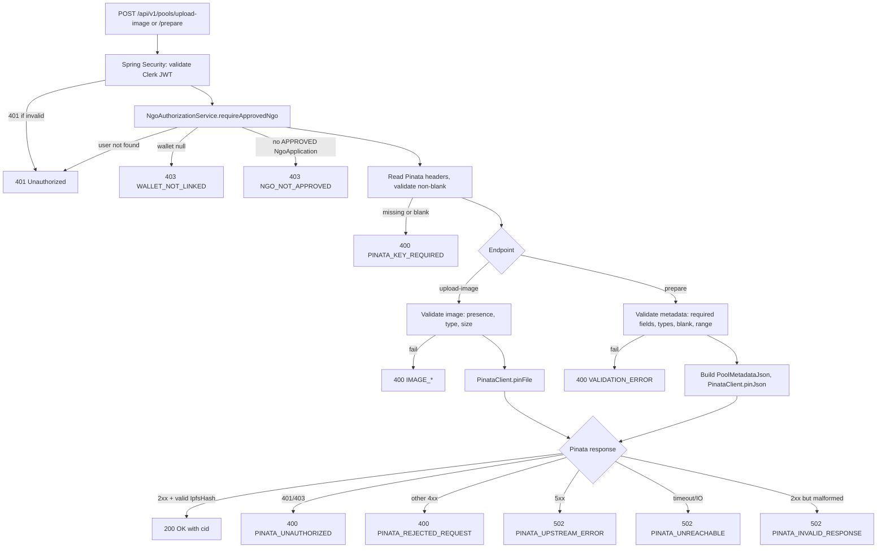

# Design Document

## Overview

This feature adds two backend endpoints that a verified NGO uses BEFORE calling `deployPool()` on-chain:

- `POST /api/v1/pools/upload-image` — uploads a cover image to IPFS via Pinata, returns `{ cid }`
- `POST /api/v1/pools/prepare` — uploads a metadata JSON document to IPFS via Pinata, returns `{ cid }`

The metadata JSON produced by `/prepare` must round-trip cleanly through `com.livana.backend.indexer.service.IpfsMetadataService.parseAndValidate`. If it does not, the indexer will mark the pool `Invalid` once `PoolDeployed` fires and the pool will be silently dropped.

The feature persists nothing. It does not call any on-chain function. It does not validate on-chain state. It only:

1. Authenticates the caller via Clerk JWT
2. Confirms the caller has a linked wallet AND an `APPROVED` `NgoApplication` for that wallet
3. Reads the NGO's Pinata API key from request headers (never persisted, never logged)
4. Forwards the upload to Pinata and returns the IPFS CID Pinata issues
5. Discards the API key from memory before responding

The Pinata HTTP client is `java.net.http.HttpClient` (same library `IpfsMetadataService` already uses). No new dependencies.

### Key design decisions

- **Separate controller (`PoolPreparationController`).** The existing `PoolController` at `/api/v1/pools` only handles public GET endpoints (listing/detail). A separate controller for the two POST endpoints keeps the public read path and the authenticated NGO write path cleanly separated, avoids mixing concerns in a single class, and lets us scope `@RequiredArgsConstructor` dependencies tightly to what each controller actually needs.
- **`PinataClient` is a single-purpose `@Service`.** It takes `(apiKey, secretKey, payload)` and returns either `Pinata.Cid` or throws a Pinata-specific exception. It owns all HTTP error → API error mapping. It never touches `HttpServletRequest` headers, never logs the keys, and is the only place the keys exist in memory after they are extracted from the request.
- **`NgoAuthorizationService.requireApprovedNgo(jwt)`** runs all three checks (auth, wallet, approved NGO) and returns the `User`. Both endpoints call it as the first line of work, before reading Pinata headers, before reading the request body, before any I/O.
- **Validation mirrors `IpfsMetadataService` exactly.** A `PoolMetadataValidator` enforces the same rule set (`title`/`description`/`region` non-blank strings, `targetAmount` JSON integer > 0, `coverImage` optional non-blank string when present). The metadata JSON is built from `JsonNode` and pinned as raw bytes so we control the wire format.
- **Reuse `ApiException` + `GlobalExceptionHandler`.** Every error path throws an `ApiException` subclass (or `ApiException` directly) with the documented error code. No bespoke `@ExceptionHandler` is added. The existing `ErrorResponse` record is the public error shape.
- **Reuse `WalletNotLinkedException` and `UserService.getAuthenticatedUserWithWallet`.** They already produce the exact 403 `WALLET_NOT_LINKED` shape we need. We do not duplicate that logic.

## Architecture

### Request flow



### Component layout

```
com.livana.backend.pool.preparation
├── controller
│   └── PoolPreparationController          // POST /upload-image, POST /prepare
├── dto
│   ├── PreparePoolRequest                 // request body for /prepare
│   └── CidResponse                        // { cid }
├── service
│   ├── NgoAuthorizationService            // auth + wallet + APPROVED NGO check
│   ├── PinataClient                       // Pinata HTTP wrapper
│   ├── PinataHeaders                      // value type: (apiKey, secretKey)
│   ├── PoolMetadataValidator              // mirrors IpfsMetadataService rules
│   └── PoolMetadataJsonBuilder            // builds canonical metadata JSON
└── exception
    ├── ImageFileRequiredException         // 400 IMAGE_FILE_REQUIRED
    ├── ImageTypeNotAllowedException       // 400 IMAGE_TYPE_NOT_ALLOWED
    ├── ImageTooLargeException             // 400 IMAGE_TOO_LARGE
    ├── PinataKeyRequiredException         // 400 PINATA_KEY_REQUIRED
    ├── NgoNotApprovedException            // 403 NGO_NOT_APPROVED
    ├── PinataUnauthorizedException        // 400 PINATA_UNAUTHORIZED
    ├── PinataRejectedException            // 400 PINATA_REJECTED_REQUEST
    ├── PinataUpstreamException            // 502 PINATA_UPSTREAM_ERROR
    ├── PinataUnreachableException         // 502 PINATA_UNREACHABLE
    └── PinataInvalidResponseException     // 502 PINATA_INVALID_RESPONSE
```

`PoolMetadataValidationException` is not added — the existing `VALIDATION_ERROR` semantics from `GlobalExceptionHandler` are reused by throwing `ApiException(BAD_REQUEST, "VALIDATION_ERROR", "...")` directly from `PoolMetadataValidator`. This matches how Bean Validation failures already surface.

### Why two endpoints, not one

The frontend uploads the cover image first to obtain its CID, then sends that CID inside the metadata body to `/prepare`. This mirrors how the indexer reads the document (`coverImage` is a CID string, not a binary attachment), keeps both endpoints small, and lets the frontend retry one without redoing the other.

### Multipart configuration

Spring Boot's default `MultipartProperties` is sufficient. We rely on `MultipartFile.getSize()`, `getContentType()`, `getOriginalFilename()`, and `getBytes()`. The endpoint reads the entire image into memory because Pinata's pinning API is a single multipart POST and the documented cap is 5 MB. We do not need streaming.

We will set the global `spring.servlet.multipart.max-file-size` and `max-request-size` to `5MB` so Spring rejects oversized payloads at the framework boundary and we never buffer >5 MB. This must align with `Max_Image_Size_Bytes = 5,242,880`.

### Security wiring

`SecurityConfig` already has `.requestMatchers(HttpMethod.GET, "/api/v1/pools/**").permitAll()` for the public read path and `.anyRequest().authenticated()` for everything else. POST under `/api/v1/pools/**` therefore already requires a valid JWT. No `SecurityConfig` change is needed.

## Components and Interfaces

### `PoolPreparationController`

```java
@RestController
@RequestMapping("/api/v1/pools")
@RequiredArgsConstructor
public class PoolPreparationController {

    private final NgoAuthorizationService ngoAuthorizationService;
    private final PinataClient pinataClient;
    private final PoolMetadataValidator metadataValidator;
    private final PoolMetadataJsonBuilder metadataJsonBuilder;

    @PostMapping(value = "/upload-image", consumes = MediaType.MULTIPART_FORM_DATA_VALUE)
    public ResponseEntity<CidResponse> uploadImage(
            @AuthenticationPrincipal Jwt jwt,
            @RequestPart(name = "file", required = false) MultipartFile file,
            HttpServletRequest request) {
        ngoAuthorizationService.requireApprovedNgo(jwt);
        ImageValidator.validate(file);                       // throws IMAGE_*
        PinataHeaders keys = PinataHeaders.fromRequest(request); // throws PINATA_KEY_REQUIRED
        try {
            String cid = pinataClient.pinFile(keys, file);   // throws PINATA_*
            return ResponseEntity.ok(new CidResponse(cid));
        } finally {
            keys.clear();                                    // overwrite key bytes
        }
    }

    @PostMapping(value = "/prepare", consumes = MediaType.APPLICATION_JSON_VALUE)
    public ResponseEntity<CidResponse> prepare(
            @AuthenticationPrincipal Jwt jwt,
            @RequestBody JsonNode body,
            HttpServletRequest request) {
        ngoAuthorizationService.requireApprovedNgo(jwt);
        PreparePoolRequest validated = metadataValidator.validate(body); // throws VALIDATION_ERROR
        byte[] canonicalJson = metadataJsonBuilder.toCanonicalJson(validated);
        PinataHeaders keys = PinataHeaders.fromRequest(request);
        try {
            String cid = pinataClient.pinJson(keys, canonicalJson);
            return ResponseEntity.ok(new CidResponse(cid));
        } finally {
            keys.clear();
        }
    }
}
```

`@RequestBody JsonNode body` is intentional: we cannot rely on Jackson binding to a record because the validator must distinguish "field missing" from "field set to JSON null" from "field is wrong type" from "field is blank string", and produce error codes that match `IpfsMetadataService` semantics exactly. Binding to a record would coerce `targetAmount: "100"` into `100L` silently, which contradicts `IpfsMetadataService.parseAndValidate` (it rejects non-integer JSON values via `JsonNode.canConvertToLong()`-equivalent checks). See **Validation parity** below.

`HttpServletRequest` is injected so `PinataHeaders.fromRequest` reads `X-Pinata-Api-Key` / `X-Pinata-Secret-Api-Key` directly. This avoids declaring `@RequestHeader` parameters that Spring binds eagerly — we want NGO authorization to fail before we read the keys.

### `NgoAuthorizationService`

```java
@Service
@RequiredArgsConstructor
public class NgoAuthorizationService {

    private final UserService userService;
    private final NgoApplicationRepository ngoApplicationRepository;

    /**
     * Runs the three checks in order:
     *   1. Resolve the user from JWT subject (404 USER_NOT_FOUND if missing)
     *   2. Require linked wallet (403 WALLET_NOT_LINKED via UserService)
     *   3. Require an APPROVED NgoApplication for the (lowercased) wallet (403 NGO_NOT_APPROVED)
     *
     * Returns the User on success.
     */
    public User requireApprovedNgo(Jwt jwt) {
        String clerkId = jwt.getSubject();
        User user = userService.getAuthenticatedUserWithWallet(clerkId);
        String wallet = user.getWalletAddress().toLowerCase(Locale.ROOT);
        ngoApplicationRepository
                .findByWalletAddressAndStatus(wallet, ApplicationStatus.APPROVED)
                .orElseThrow(NgoNotApprovedException::new);
        return user;
    }
}
```

The wallet is already stored lowercase by `UserService.linkWallet`, but lowercasing again here is defensive: the helper does not trust callers to have done it.

### `PinataHeaders`

```java
public final class PinataHeaders {

    public static final String API_KEY_HEADER = "X-Pinata-Api-Key";
    public static final String SECRET_KEY_HEADER = "X-Pinata-Secret-Api-Key";

    private char[] apiKey;
    private char[] secretKey;

    public static PinataHeaders fromRequest(HttpServletRequest request) {
        String api = request.getHeader(API_KEY_HEADER);
        String secret = request.getHeader(SECRET_KEY_HEADER);
        if (api == null || api.isBlank()) {
            throw new PinataKeyRequiredException(API_KEY_HEADER);
        }
        if (secret == null || secret.isBlank()) {
            throw new PinataKeyRequiredException(SECRET_KEY_HEADER);
        }
        return new PinataHeaders(api.toCharArray(), secret.toCharArray());
    }

    public String apiKey()    { return new String(apiKey); }
    public String secretKey() { return new String(secretKey); }

    /** Overwrite key material so it does not linger in heap until GC. */
    public void clear() {
        if (apiKey != null)    Arrays.fill(apiKey, '\0');
        if (secretKey != null) Arrays.fill(secretKey, '\0');
        apiKey = null;
        secretKey = null;
    }
}
```

`char[]` rather than `String` is used because `String` is immutable and cannot be wiped from memory before GC. This matches the standard Java idiom for transient credentials. `apiKey()` / `secretKey()` materialize a fresh `String` only at the moment we hand bytes to `HttpClient` — the `String` instance does not outlive the request because we drop the reference inside `PinataClient` and call `clear()` in the controller's `finally`.

We accept that values placed into HTTP headers go through Java's standard string handling inside `HttpClient`. The promise of Requirement 7 is "no log line, no exception message, no error body, no persistence" — not zero-copy through the JDK. This is consistent with how every Spring Boot service handles bearer tokens.

### `PinataClient`

```java
@Service
@RequiredArgsConstructor
@Slf4j
public class PinataClient {

    private static final URI PIN_FILE_URL = URI.create("https://api.pinata.cloud/pinning/pinFileToIPFS");
    private static final URI PIN_JSON_URL = URI.create("https://api.pinata.cloud/pinning/pinJSONToIPFS");
    private static final Duration TIMEOUT = Duration.ofSeconds(30);

    private final HttpClient httpClient;       // bean from PinataHttpConfig — wraps java.net.http.HttpClient
    private final ObjectMapper objectMapper;   // Jackson 2 ObjectMapper from JacksonConfig

    public String pinFile(PinataHeaders keys, MultipartFile file) {
        HttpRequest request = buildMultipartRequest(PIN_FILE_URL, keys, file);
        return send(PIN_FILE_URL, request);
    }

    public String pinJson(PinataHeaders keys, byte[] canonicalJson) {
        HttpRequest request = HttpRequest.newBuilder()
                .uri(PIN_JSON_URL)
                .timeout(TIMEOUT)
                .header("Content-Type", "application/json")
                .header("pinata_api_key", keys.apiKey())
                .header("pinata_secret_api_key", keys.secretKey())
                .POST(HttpRequest.BodyPublishers.ofByteArray(canonicalJson))
                .build();
        return send(PIN_JSON_URL, request);
    }

    private String send(URI url, HttpRequest request) {
        HttpResponse<String> response;
        try {
            response = httpClient.send(request, HttpResponse.BodyHandlers.ofString());
        } catch (HttpTimeoutException e) {
            log.warn("Pinata request to {} timed out", url);
            throw new PinataUnreachableException("Pinata request timed out");
        } catch (IOException | InterruptedException e) {
            if (e instanceof InterruptedException) Thread.currentThread().interrupt();
            log.warn("Pinata request to {} failed: {}", url, e.getClass().getSimpleName());
            throw new PinataUnreachableException("Pinata request failed");
        }

        int status = response.statusCode();
        if (status == 200) {
            String cid = extractIpfsHash(response.body());           // throws PINATA_INVALID_RESPONSE
            log.info("Pinata pin succeeded url={} status=200 cid={}", url, cid);
            return cid;
        }
        log.info("Pinata pin failed url={} status={}", url, status);
        if (status == 401 || status == 403) throw new PinataUnauthorizedException();
        if (status >= 400 && status < 500) throw new PinataRejectedException(status);
        if (status >= 500 && status < 600) throw new PinataUpstreamException();
        throw new PinataInvalidResponseException("Unexpected status " + status);
    }

    private String extractIpfsHash(String body) {
        try {
            JsonNode root = objectMapper.readTree(body);
            JsonNode hash = root.get("IpfsHash");
            if (hash == null || !hash.isTextual() || hash.asText().isBlank()) {
                throw new PinataInvalidResponseException("Missing or blank IpfsHash");
            }
            return hash.asText();
        } catch (JsonProcessingException e) {
            throw new PinataInvalidResponseException("Malformed Pinata response");
        }
    }
}
```

`HttpClient` is injected (not a static `final`) so tests can swap it for a fake. A `@Configuration` class (`PinataHttpConfig`) exposes the bean:

```java
@Configuration
class PinataHttpConfig {
    @Bean
    HttpClient pinataHttpClient() {
        return HttpClient.newBuilder()
                .connectTimeout(Duration.ofSeconds(30))
                .build();
    }
}
```

The 30-second timeout is set per `HttpRequest` (read timeout) because `HttpClient.connectTimeout` only covers the TCP/TLS handshake. Setting both ensures a stuck Pinata connection cannot block longer than 30 s end-to-end.

#### Multipart construction

`java.net.http.HttpClient` does not ship a multipart body publisher. We construct one manually:

```java
private HttpRequest buildMultipartRequest(URI url, PinataHeaders keys, MultipartFile file) {
    String boundary = "----LivanaBoundary" + UUID.randomUUID();
    byte[] body = buildMultipartBody(boundary, file);   // includes the file part named "file"
    return HttpRequest.newBuilder()
            .uri(url)
            .timeout(TIMEOUT)
            .header("Content-Type", "multipart/form-data; boundary=" + boundary)
            .header("pinata_api_key", keys.apiKey())
            .header("pinata_secret_api_key", keys.secretKey())
            .POST(HttpRequest.BodyPublishers.ofByteArray(body))
            .build();
}
```

`buildMultipartBody` writes the standard RFC 7578 form: `--boundary\r\nContent-Disposition: form-data; name="file"; filename="<original>"\r\nContent-Type: <mime>\r\n\r\n<bytes>\r\n--boundary--\r\n`. The original filename and content type come from `MultipartFile`. This is small enough to keep inline and avoids pulling in a multipart library.

### `ImageValidator`

```java
final class ImageValidator {
    static final long MAX_BYTES = 5L * 1024 * 1024;
    static final Set<String> ALLOWED = Set.of("image/jpeg", "image/png", "image/webp");

    static void validate(MultipartFile file) {
        if (file == null || file.isEmpty()) throw new ImageFileRequiredException();
        String type = file.getContentType();
        if (type == null || !ALLOWED.contains(type.toLowerCase(Locale.ROOT))) {
            throw new ImageTypeNotAllowedException(type);
        }
        if (file.getSize() > MAX_BYTES) throw new ImageTooLargeException(MAX_BYTES);
    }
}
```

Order is fixed by Requirement 2.1: presence → type → size. Multiple-file detection is handled at the controller boundary by Spring: `@RequestPart("file")` binds a single part; if the request contains a second file part with a different name it is silently ignored, but if it contains a second part also named `file` Spring binds the first only. To honor Requirement 1.4 ("more than one file part → 400 INVALID_REQUEST") we additionally inspect `MultipartHttpServletRequest.getFileMap()` and throw `ApiException(BAD_REQUEST, "INVALID_REQUEST", ...)` if more than one file part is present, regardless of name.

### `PoolMetadataValidator`

```java
@Component
public class PoolMetadataValidator {

    public PreparePoolRequest validate(JsonNode body) {
        if (body == null || !body.isObject()) {
            throw validationError("request body must be a JSON object");
        }
        String title       = requireNonBlankString(body, "title");
        String description = requireNonBlankString(body, "description");
        String region      = requireNonBlankString(body, "region");
        long targetAmount  = requirePositiveLong(body, "targetAmount");
        String coverImage  = optionalNonBlankString(body, "coverImage");
        return new PreparePoolRequest(title, description, region, coverImage, targetAmount);
    }

    private static String requireNonBlankString(JsonNode body, String field) {
        JsonNode node = body.get(field);
        if (node == null || node.isNull()) {
            throw validationError(field + " is required");
        }
        if (!node.isTextual()) {
            throw validationError(field + " must be a string");
        }
        String text = node.asText();
        if (text.isBlank()) {
            throw validationError(field + " must not be blank");
        }
        return text;
    }

    private static long requirePositiveLong(JsonNode body, String field) {
        JsonNode node = body.get(field);
        if (node == null || node.isNull()) {
            throw validationError(field + " is required");
        }
        if (!node.isIntegralNumber() || !node.canConvertToLong()) {
            throw validationError(field + " must be a JSON integer in long range");
        }
        long value = node.asLong();
        if (value <= 0) {
            throw validationError(field + " must be greater than 0");
        }
        return value;
    }

    private static String optionalNonBlankString(JsonNode body, String field) {
        JsonNode node = body.get(field);
        if (node == null || node.isNull()) return null;
        if (!node.isTextual()) {
            throw validationError(field + " must be a string when present");
        }
        String text = node.asText();
        if (text.isBlank()) {
            throw validationError(field + " must not be blank when present");
        }
        return text;
    }

    private static ApiException validationError(String message) {
        return new ApiException(HttpStatus.BAD_REQUEST, "VALIDATION_ERROR", message);
    }
}
```

#### Validation parity with `IpfsMetadataService`

| Rule | `IpfsMetadataService.parseAndValidate` | `PoolMetadataValidator` |
|---|---|---|
| Required fields | `root.has("title") && has("description") && has("region") && has("targetAmount")` | identical, with explicit `null` check |
| String non-blank | `title.isBlank() \|\| description.isBlank() \|\| region.isBlank()` | identical |
| `targetAmount > 0` | `root.get("targetAmount").asLong() > 0` (returns 0 on non-numeric, which fails the `> 0` check) | stricter: rejects non-integer types explicitly with a clear error |
| `coverImage` optional | `root.has("coverImage") ? asText(null) : null` | accepts present-non-blank or absent, rejects present-blank |

The validator is **stricter** than `IpfsMetadataService` on `targetAmount` types (rejecting decimals/strings that the indexer's `asLong()` would silently coerce to 0 and then reject). This is required by Requirement 4.4 and is safe because rejecting more inputs cannot cause a pool to silently drop. Property 4 (round-trip) ensures validator output always passes the indexer.

### `PoolMetadataJsonBuilder`

```java
@Component
@RequiredArgsConstructor
public class PoolMetadataJsonBuilder {

    private final ObjectMapper objectMapper;

    public byte[] toCanonicalJson(PreparePoolRequest req) {
        ObjectNode root = objectMapper.createObjectNode();
        root.put("title", req.title());
        root.put("description", req.description());
        root.put("region", req.region());
        if (req.coverImage() != null) {
            root.put("coverImage", req.coverImage());
        }
        root.put("targetAmount", req.targetAmount());   // long → JSON integer, no quotes, no decimal
        try {
            return objectMapper.writeValueAsBytes(root);
        } catch (JsonProcessingException e) {
            throw new IllegalStateException("Unreachable: ObjectNode is always serializable", e);
        }
    }
}
```

`ObjectNode.put(String, long)` produces a JSON integer literal (e.g. `1000000`), satisfying Requirement 3.4 and matching `IpfsMetadataService.parseAndValidate`'s `asLong()` reader.

The field set is exactly `{title, description, region, [coverImage], targetAmount}` — no extras, no metadata fields — to avoid leaking unrelated state and to keep the wire format minimal.

## Data Models

### Request DTOs

```java
public record PreparePoolRequest(
        String title,
        String description,
        String region,
        String coverImage,    // nullable
        long targetAmount
) {}
```

This is **not** annotated with Bean Validation. The `PoolMetadataValidator` is the source of truth so we can produce error codes that exactly match `IpfsMetadataService` semantics.

### Response DTOs

```java
public record CidResponse(String cid) {}
```

Both endpoints return this on 200. The single `cid` field guarantees the stable response shape required by Requirement 9.

### `PinataHeaders` (value type)

See definition in Components. Carries `(apiKey, secretKey)` from controller to `PinataClient`. Mutable in the sense that `clear()` zeroes the underlying `char[]`. Not thread-safe; one instance per request.

### Persisted entities

**None.** This feature persists nothing. No new tables, no new columns, no new migrations. The only DB read is the existing `NgoApplicationRepository.findByWalletAddressAndStatus(wallet, APPROVED)` lookup.

### Outbound JSON sent to Pinata

```json
{
  "title": "Clean Water for Village X",
  "description": "...",
  "region": "South Asia",
  "coverImage": "QmCoverCid...",
  "targetAmount": 100000000
}
```

`coverImage` is omitted entirely when the request did not provide one. Field order is the order written by `PoolMetadataJsonBuilder`. The indexer does not care about order — it accesses fields by name via `JsonNode.get(name)` — but writing in a fixed order keeps test assertions and logs predictable.

### Error response body

Reuses the existing `GlobalExceptionHandler.ErrorResponse(errorCode, message, timestamp)` record. No new shape.


## Correctness Properties

*A property is a characteristic or behavior that should hold true across all valid executions of a system — essentially, a formal statement about what the system should do. Properties serve as the bridge between human-readable specifications and machine-verifiable correctness guarantees.*

The properties below are the result of the prework analysis above and the property reflection that consolidated overlapping criteria. PBT is appropriate here because (a) the metadata builder + validator are pure, (b) `IpfsMetadataService.parseAndValidate` is the indexer's gatekeeper and divergence between our writer and that reader silently drops pools — exactly the class of bug PBT excels at, and (c) the input space (Unicode strings, arbitrary positive longs, JsonNode shapes, HTTP status codes, header value strings) is large enough that 100+ random samples find edge cases hand-written examples miss.

### Property 1: Round-trip with `IpfsMetadataService`

*For any* valid `PreparePoolRequest` (non-blank `title`, `description`, `region`; `targetAmount` ∈ (0, Long.MAX_VALUE]; `coverImage` either null or a non-blank string), `IpfsMetadataService.parseAndValidate(PoolMetadataJsonBuilder.toCanonicalJson(request))` returns `MetadataResult.Valid(metadata)` where `metadata.title()`, `metadata.description()`, `metadata.region()` equal the request values codepoint-exact, `metadata.targetAmount()` equals the request `targetAmount` exactly, and `metadata.coverImage()` equals the request `coverImage` (or `null` when the request `coverImage` was `null`).

**Validates: Requirements 3.3, 3.4, 10.1, 10.2, 10.3, 10.4**

### Property 2: Validator parity with `IpfsMetadataService`

*For any* `JsonNode` body that `PoolMetadataValidator.validate` rejects with error code `VALIDATION_ERROR` for a schema reason (a required field is absent or `null`; `title`, `description`, or `region` is non-string or blank; `targetAmount` is non-integer, ≤ 0, or out of long range; `coverImage` is present but non-string or blank), feeding the same JSON to `IpfsMetadataService.parseAndValidate` returns `MetadataResult.Invalid`. (Where the indexer's `JsonNode.asLong()` would silently coerce a non-integer to 0, the resulting 0 still fails the indexer's `> 0` check, so the consolidated invariant is "validator rejects ⇒ indexer also rejects".)

**Validates: Requirements 4.1, 4.2, 4.3, 4.4, 4.5, 10.5**

### Property 3: Outbound JSON shape

*For any* valid `PreparePoolRequest`, the byte array produced by `PoolMetadataJsonBuilder.toCanonicalJson(request)`, parsed as JSON, is an object whose field set is exactly `{title, description, region, targetAmount}` when `request.coverImage()` is `null`, and exactly `{title, description, region, coverImage, targetAmount}` when `request.coverImage()` is non-null.

**Validates: Requirements 3.2, 4.6**

### Property 4: Image validator decision and error ordering

*For any* triple `(presence, contentType, size)` where `presence ∈ {absent, empty, non-empty}`, `contentType` is any string or `null`, and `size` is any non-negative long, `ImageValidator.validate` accepts the input if and only if all of the following hold simultaneously: `presence == non-empty` AND `contentType.toLowerCase()` is in `{image/jpeg, image/png, image/webp}` AND `size ≤ 5,242,880`. When any rule fails, the thrown error code matches the first rule that fails in the documented order: presence → type → size, mapping to `IMAGE_FILE_REQUIRED` → `IMAGE_TYPE_NOT_ALLOWED` → `IMAGE_TOO_LARGE`.

**Validates: Requirements 1.3, 2.1, 2.2, 2.3, 2.4**

### Property 5: Pinata header extraction

*For any* pair of header values `(apiHeader, secretHeader)` where each value is any string or absent, and *for any* case-permutation of the header names `X-Pinata-Api-Key` and `X-Pinata-Secret-Api-Key`, `PinataHeaders.fromRequest` succeeds if and only if both header names are present with non-null, non-whitespace-only values; otherwise it throws `PinataKeyRequiredException` with HTTP 400 `PINATA_KEY_REQUIRED` and no outbound HTTP request to Pinata is initiated by this code path.

**Validates: Requirements 7.1, 7.2**

### Property 6: Pinata header forwarding

*For any* non-blank pair `(apiKey, secretKey)` extracted from the request headers, every outbound `HttpRequest` issued by `PinataClient` (for both `pinFile` and `pinJson`) carries the header `pinata_api_key` with value equal to `apiKey` byte-for-byte and the header `pinata_secret_api_key` with value equal to `secretKey` byte-for-byte.

**Validates: Requirements 7.3**

### Property 7: Pinata key non-leakage

*For any* non-blank `(apiKey, secretKey)` pair on an inbound request, across every terminal outcome of the request (200 success; Pinata 4xx, 5xx; HTTP timeout; IO failure; malformed Pinata response; pre-Pinata validation rejection of body or image; `WALLET_NOT_LINKED`; `NGO_NOT_APPROVED`), no log statement emitted by classes in `com.livana.backend.pool.preparation` and no byte of the HTTP response body sent to the caller contains the value of `apiKey` or `secretKey`.

**Validates: Requirements 7.4, 7.6, 7.7**

### Property 8: Pinata status mapping

*For any* HTTP status `S ∈ [200, 600)` and response body `B` returned by Pinata, the response of the Livana endpoint is determined by:
- `S == 200` and `B` is a JSON object with a non-blank textual `IpfsHash` field → HTTP 200 with body `{cid: <IpfsHash>}`
- `S == 200` and `B` is malformed JSON OR `IpfsHash` is missing/non-string/blank → HTTP 502 `PINATA_INVALID_RESPONSE`
- `S ∈ {401, 403}` → HTTP 400 `PINATA_UNAUTHORIZED`
- `S ∈ [400, 500) \ {401, 403}` → HTTP 400 `PINATA_REJECTED_REQUEST` with the numeric value of `S` present in the response message
- `S ∈ [500, 600)` → HTTP 502 `PINATA_UPSTREAM_ERROR`

**Validates: Requirements 8.1, 8.3, 8.4, 8.6**

### Property 9: Error response shape

*For any* request to `/api/v1/pools/upload-image` or `/api/v1/pools/prepare` whose response is not HTTP 200, the response carries `Content-Type: application/json`, the body parses as the `ErrorResponse(errorCode, message, timestamp)` record, all three fields are non-null, and the body contains no field named `cid`.

**Validates: Requirements 9.3, 9.4, 9.5, 8.7**

### Property 10: Wallet lowercasing in NGO lookup

*For any* `User` whose `walletAddress` is a 42-character hex string in any mixed-case form, `NgoAuthorizationService.requireApprovedNgo` invokes `NgoApplicationRepository.findByWalletAddressAndStatus` with the address argument equal to the input lowercased and the status argument equal to `ApplicationStatus.APPROVED`.

**Validates: Requirements 6.1**

## Error Handling

### Mapping to existing infrastructure

Every error path raises an `ApiException` (or a subclass). `GlobalExceptionHandler.handleApiException` already converts any `ApiException` into the standard `ErrorResponse(errorCode, message, timestamp)` body with the right HTTP status. **No new `@ExceptionHandler` is added.**

| Trigger | Exception | HTTP | Error Code |
|---|---|---|---|
| Missing/invalid Clerk JWT | (Spring Security) | 401 | (Spring default body) |
| JWT subject does not resolve to a user | `ApiException` thrown by `UserService.getAuthenticatedUserWithWallet` (currently 404 `USER_NOT_FOUND`) — see note below | 401 | `USER_NOT_FOUND` |
| User has no linked wallet | `WalletNotLinkedException` (existing) | 403 | `WALLET_NOT_LINKED` |
| No `APPROVED` `NgoApplication` for wallet | `NgoNotApprovedException` (new) | 403 | `NGO_NOT_APPROVED` |
| Missing/blank Pinata headers | `PinataKeyRequiredException` (new) | 400 | `PINATA_KEY_REQUIRED` |
| Image part missing or empty | `ImageFileRequiredException` (new) | 400 | `IMAGE_FILE_REQUIRED` |
| Image content-type wrong | `ImageTypeNotAllowedException` (new) | 400 | `IMAGE_TYPE_NOT_ALLOWED` |
| Image > 5 MB | `ImageTooLargeException` (new) | 400 | `IMAGE_TOO_LARGE` |
| More than one file part | direct `ApiException(BAD_REQUEST, "INVALID_REQUEST", ...)` | 400 | `INVALID_REQUEST` |
| Metadata schema violation | direct `ApiException(BAD_REQUEST, "VALIDATION_ERROR", ...)` from `PoolMetadataValidator` | 400 | `VALIDATION_ERROR` |
| Pinata 401/403 | `PinataUnauthorizedException` | 400 | `PINATA_UNAUTHORIZED` |
| Pinata other 4xx | `PinataRejectedException(int upstreamStatus)` | 400 | `PINATA_REJECTED_REQUEST` |
| Pinata 5xx | `PinataUpstreamException` | 502 | `PINATA_UPSTREAM_ERROR` |
| Pinata IO/timeout | `PinataUnreachableException` | 502 | `PINATA_UNREACHABLE` |
| Pinata 200 with bad body | `PinataInvalidResponseException` | 502 | `PINATA_INVALID_RESPONSE` |

#### Note on Requirement 5.4 (JWT subject does not resolve → 401)

`UserService.getAuthenticatedUserWithWallet` currently throws `ApiException(NOT_FOUND, "USER_NOT_FOUND", ...)` when no user matches the Clerk subject. Requirement 5.4 says this case must return **401**. Two options:

1. Add a small adapter in `NgoAuthorizationService` that catches `USER_NOT_FOUND` and rethrows as `ApiException(UNAUTHORIZED, "USER_NOT_FOUND", ...)`.
2. Change `UserService.getAuthenticatedUserWithWallet` to throw 401 directly.

We pick option (1) so we do not change `UserService` semantics for other consumers (`UserController`, etc.). The conversion is local to this feature.

### Common error properties (enforced by `Property 7` and `Property 9`)

- Error response body is always JSON, always shaped as `ErrorResponse`, never contains `cid`.
- No log line, exception message, or response body contains a Pinata API key or secret key — including upstream-error and timeout paths. Log statements use only the URL, status code, and (on success) the resulting CID.
- Errors raised before `PinataClient.send` is called result in zero outbound HTTP requests to Pinata. This is testable by spying on the `HttpClient` bean in MockMvc tests.
- Errors never persist anything. The package contains no `@Repository`, no `EntityManager`, no `JpaRepository`. The only DB read is `findByWalletAndStatus` in `NgoAuthorizationService`, which is read-only.

### Multipart framework limits

Spring Boot's `MultipartException` (raised when the framework's `max-file-size` is exceeded before our code runs) is surfaced through `GlobalExceptionHandler.handleGeneral` as 500 today. To honor Requirement 2.4 (5 MB → `IMAGE_TOO_LARGE` 400), we add a single targeted `@ExceptionHandler(MaxUploadSizeExceededException.class)` to `GlobalExceptionHandler` (or in this feature's controller advice if we prefer to keep the global handler untouched) that returns 400 `IMAGE_TOO_LARGE`. This is the only addition to `GlobalExceptionHandler`.

### Pinata key memory lifecycle on error

The controller's `try { ... } finally { keys.clear(); }` ensures that whether the call returns normally, throws, or is interrupted, the `char[]` backing the key values is overwritten with `\0` before the response leaves the controller. The `PinataHeaders` instance is not retained anywhere — it is request-scoped via stack lifetime.

## Testing Strategy

### Test pyramid

Three layers:

1. **Unit tests** (fast, isolated):
   - `PoolMetadataValidator` — validation logic.
   - `PoolMetadataJsonBuilder` — JSON shape.
   - `ImageValidator` — image rules.
   - `PinataHeaders.fromRequest` — header extraction and `clear()` behavior.
   - `PinataClient` — status-code mapping with a fake `HttpClient`.
   - `NgoAuthorizationService` — three checks in order, with mocked `UserService` + `NgoApplicationRepository`.

2. **Property-based tests** (jqwik, 100+ iterations each):
   - Properties P1–P10 above.

3. **Web-layer integration tests** (`@WebMvcTest` + `MockMvc` + a fake `HttpClient` bean):
   - End-to-end happy paths for both endpoints.
   - End-to-end error paths for each documented error code.
   - Auth/wallet/NGO short-circuit ordering.

We do **not** add WireMock. The Pinata client takes a `HttpClient` bean, and tests inject a fake `HttpClient` (a small subclass that returns canned `HttpResponse` objects or throws). This keeps the test boundary at the JDK seam, runs in-process, has zero network dependency, and matches the seam already used by `IpfsMetadataService`.

### Property-based testing setup

Library: **jqwik 1.9.1** (already in `pom.xml`). Each property test:

- Declares `@Property(tries = 100)` (minimum).
- Has a comment header in the documented tag format.
- Uses jqwik `@ForAll` providers for inputs.

Tag format example:

```java
// Feature: pool-creation-preparation, Property 1: For any valid PreparePoolRequest,
// parseAndValidate(toCanonicalJson(request)) returns Valid with all field values equal to the request.
@Property(tries = 200)
boolean roundTripWithIpfsMetadataService(@ForAll("validRequests") PreparePoolRequest req) { ... }
```

### Generators (jqwik `Arbitraries`)

| Type | Generator |
|---|---|
| Non-blank text | `Arbitraries.strings().ofMinLength(1).ofMaxLength(500).filter(s -> !s.isBlank())` |
| Whitespace-only text | `Arbitraries.strings().withChars(" \t\n\r\u00A0\u2003").ofMinLength(1).ofMaxLength(20)` |
| Positive long | `Arbitraries.longs().between(1L, Long.MAX_VALUE)` |
| Non-positive long | `Arbitraries.longs().between(Long.MIN_VALUE, 0L)` |
| Hex address (mixed case) | hand-rolled provider: `0x` + 40 hex chars with arbitrary case folding |
| HTTP status | `Arbitraries.integers().between(200, 599)` |
| Image content type | union of allowed and arbitrary other strings |
| Image size | `Arbitraries.longs().between(0L, 10_485_760L)` (covers 0 to 10 MB) |
| Pinata response body | union of well-formed `{IpfsHash: "<random>"}`, malformed JSON, missing field, non-string field, blank field |

For Property 1 (round-trip) and Property 3 (outbound JSON shape), the request generator produces the full PreparePoolRequest space including:

- Strings with internal whitespace, Unicode (CJK, RTL, emoji), control characters that are not whitespace, very long strings.
- `coverImage` being null in some fraction of cases, present in others.
- `targetAmount` covering 1, small values, large values up to `Long.MAX_VALUE`.

### Image content-type and size — synthetic `MultipartFile`

For Property 4, we use a tiny in-memory `MultipartFile` whose `getBytes()` returns an empty array but `getSize()` returns the generated `size`. This lets us test sizes up to many GB without allocating bytes. The validator only inspects size and content-type; it does not read the file body. The `PinataClient` is mocked, so the test never tries to upload the bytes.

### Coverage of EXAMPLE-class criteria

Each EXAMPLE classification from the prework gets at least one MockMvc test:

- 1.1, 3.1: happy paths for both endpoints.
- 1.2, 1.4: file-part naming and count.
- 4.7, 5.3, 6.3: ordering — e.g. malformed body + missing wallet returns `WALLET_NOT_LINKED` (auth wins), missing Pinata header + no approved NGO returns `NGO_NOT_APPROVED` (NGO check wins).
- 5.1, 5.2, 5.4: auth/wallet/user-not-found.
- 6.2: no approved NGO.
- 8.1, 8.2, 8.5: Pinata 200 happy, Pinata 401/403, Pinata timeout/IO.
- 8.7: error response body never carries `cid`.
- 7.4: `PinataHeaders.clear()` overwrites the `char[]`.
- 7.7: log format on success.
- 9.1, 9.2: response shape `{cid: ...}` on success.

### Smoke / structural tests

- **No persistence** in `pool.preparation`: a small structural test asserts the package contains no class annotated `@Repository` or having a field of type `EntityManager` / `JpaRepository`. This validates Requirement 7.5.

### Unit-test discipline

Unit tests focus on:

- Specific examples that demonstrate happy-path behavior.
- Integration points (`NgoAuthorizationService` → `UserService` + `NgoApplicationRepository`).
- Error code mapping (one example per documented error).

Property tests handle the input space — we do not write 30 unit tests covering every Pinata 4xx status; one property covers `[400, 500)`.

### Test data isolation

Tests do not require Postgres. `@WebMvcTest` slices in only the controllers, services under test, and a fake `HttpClient`. The `NgoApplicationRepository` and `UserService` are mocked. This keeps the suite fast and lets it run without Testcontainers in CI for this feature.
