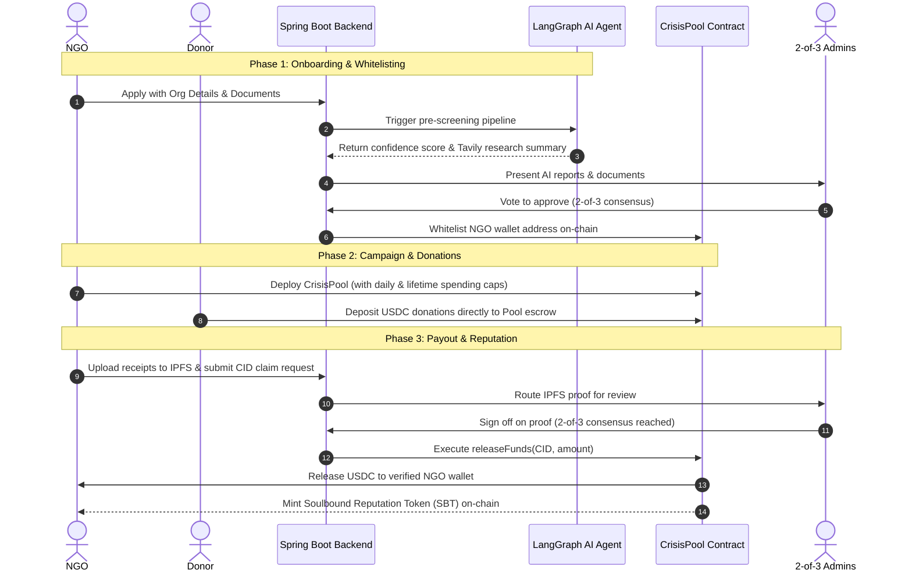

# 🌸 Livana

[](https://soliditylang.org/)
[](https://spring.io/projects/spring-boot)
[](https://fastapi.tiangolo.com/)
[](https://langchain-ai.github.io/langgraph/)
[](https://book.getfoundry.sh/)

> **Re-engineering Humanitarian Aid.** An open-source, blockchain-powered charitable fundraising platform that replaces blind trust with cryptographic proof, AI-driven NGO pre-screening, multi-signature admin consensus, and on-chain reputation histories.

---

## 📖 Table of Contents
1. [The Crisis in Modern Charity](#-the-crisis-in-modern-charity)
2. [Our Core Philosophy](#-our-core-philosophy)
3. [System Architecture & Lifecycle](#-system-architecture--lifecycle)
4. [Component Architecture](#-component-architecture)
5. [Quick Start (Docker Compose)](#-quick-start-docker-compose)
6. [Local Component Setup](#-local-component-setup)
7. [Smart Contract Layout](#-smart-contract-layout)
8. [Configuration Reference](#-configuration-reference)

---

## 🚨 The Crisis in Modern Charity

1. **Zero Transparency:** Donors lack verifiable ways to track how their funds are spent. Mismanagement scandals routinely erode public trust in legacy NGOs.
2. **Friction-Ridden Payouts:** Traditional banking rails (SWIFT/Wire) introduce high fees and multi-day delays, halting critical crisis relief on the ground.
3. **Fragile NGO Accountability:** Evaluation of non-profits remains centralized and opaque. There is no real-time audit trail of actual aid deliveries.

---

## 🛡️ Our Core Philosophy

Livana secures the donation lifecycle using a **Double-Gate Trust Model**—strict verification at onboarding and consensus-based authorization at payout:

| Stage | Mechanism | Security Feature | Controller |
| :--- | :--- | :--- | :--- |
| **1. NGO Onboarding** | LangGraph AI Screening + Web Search | Confidence score & domain verification | AI Agent |
| **2. Whitelisting** | Multi-Sig Admin Consensus | 2-of-3 administrators must sign off to whitelist | Admins (On-chain) |
| **3. Pool Creation** | Factory Pattern | Immutable spending caps & region limits | Whitelisted NGO |
| **4. Payout Escrow** | USDC Escrow Contracts | Payouts are locked in individual smart contracts | Open (Donors) |
| **5. Claim Proof** | IPFS Content Addressing | Immutable receipts/invoices stored permanently | NGO |
| **6. Fund Release** | 2-of-3 Multi-Sig Verification | Admins must manually audit and sign off on IPFS proofs | Admins (On-chain) |
| **7. Reputation** | Soulbound Tokens (SBT) | Non-transferable tokens record total verified aid on-chain | Automatic |

---

## 🎨 System Architecture & Lifecycle

The lifecycle of an aid campaign on Livana is divided into onboarding, fundraising, and verification:



---

## 🧩 Component Architecture

The repository is organized into three distinct decoupling services:

### 1. [`/smartcontracts`](file:///c:/Projects/Livana/smartcontracts)
*   **Role:** The single source of truth for funds escrow, whitelist state, spending limit enforcement, and reputation tracking.
*   **Technologies:** Solidity, Foundry (Forge/Anvil).
*   **Key Contracts:** 
    *   `PoolFactory.sol`: Whitelists verified NGO addresses and deploys campaign contracts.
    *   `CrisisPool.sol`: Escrows USDC donations, enforces immutable spending limits, and manages multi-sig release.
    *   `SoulboundToken.sol`: Non-transferable ERC-721 token representing verified history.

### 2. [`/backend`](file:///c:/Projects/Livana/backend)
*   **Role:** Acts as the central REST API coordinator, manages application metadata in PostgreSQL, tracks Clerk sessions, and triggers blockchain transactions.
*   **Technologies:** Spring Boot 3, Java 17, Web3j, Spring Security, Hibernate/JPA, PostgreSQL.

### 3. [`/ai-screening`](file:///c:/Projects/Livana/ai-screening)
*   **Role:** An isolated pre-screening agent that analyzes NGO registrations and searches the web to calculate trust scores.
*   **Technologies:** FastAPI, Python 3.11, LangGraph, LangChain, Gemini API, Tavily Search API.

---

## ⚡ Quick Start (Docker Compose)

Get a complete local environment running in minutes.

### 1. Clone & Setup Configuration
Copy the default environment template to write your local secrets:
```bash
cp .env.example .env
```
Open `.env` and fill in:
*   `CLERK_SECRET_KEY`: Your Clerk API credentials.
*   `TAVILY_API_KEY`: Your Tavily developer API key (used for AI web research).
*   `AI_CONFIG_ENCRYPTION_KEY`: A 32-byte Base64-encoded key used to secure credentials.

### 2. Spin Up Services
Compile the projects and launch the container group:
```bash
docker compose up --build
```
This starts:
*   **Postgres Database:** `localhost:5432` (persistent data mapped to `postgres-data`)
*   **Java Backend API:** `http://localhost:8080`
*   **AI Screening Service:** `http://localhost:8000`

---

## 🛠️ Local Component Setup

If you prefer to run services individually without Docker:

### Prerequisites
*   **Java SDK 17**
*   **Python 3.11+**
*   **Foundry (Forge/Anvil)**
*   **PostgreSQL 16**

### Backend API
Navigate to the backend directory, run clean build, and launch:
```bash
cd backend
./mvnw clean install
./mvnw spring-boot:run
```

### Smart Contracts
Install dependencies, compile, and run tests:
```bash
cd smartcontracts
forge install
forge build
forge test
```

### AI Screening Service
Install virtual environment, project dependencies, and spin up development server:
```bash
cd ai-screening
python -m venv venv
source venv/bin/activate  # On Windows: .\venv\Scripts\activate
pip install -e .
uvicorn ai_screening.main:app --reload --port 8000
```

---

## ⚙️ Configuration Reference

The application behaviors are governed by the following variables declared in `.env`:

| Variable | Description | Example / Default |
| :--- | :--- | :--- |
| `AI_SCREENING_SHARED_SECRET` | Header validation token between API & AI services | `change-me-shared-secret` |
| `AI_CONFIG_ENCRYPTION_KEY` | 32-byte Base64 AES key to encrypt Gemini key at rest | `openssl rand -base64 32` |
| `CLERK_SECRET_KEY` | Clerk secret key for validating user sessions | `sk_test_...` |
| `TAVILY_API_KEY` | Tavily Web Search API key for agent research | `tvly-...` |
| `GEMINI_MODEL` | Gemini model version utilized by LangGraph | `gemini-2.0-flash` |
| `IPFS_GATEWAY_URL` | Endpoint to retrieve uploaded receipts | `https://gateway.pinata.cloud/ipfs/` |
