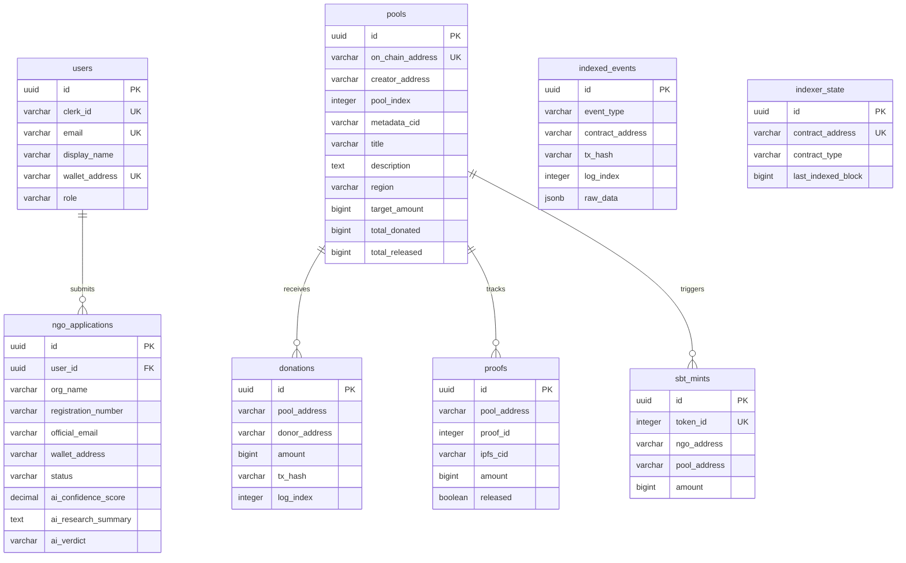

# Livana — Database Schema Design

## Design Principles

1. **UUIDs for all primary keys** — no auto-increment leakage, works if we ever shard
2. **Wallet/tx addresses stored lowercase VARCHAR(42/66)** — normalized on write
3. **USDC amounts stored as BIGINT** — raw 6-decimal values (1 USDC = 1000000). BIGINT handles up to 9.2×10¹⁸, far beyond total USDC supply
4. **Denormalized event tables** — `donations`, `proofs`, `sbt_mints` are derived from `indexed_events` for fast queries. The raw events table is the audit trail.
5. **Running totals on pools** — `total_donated`, `total_released` maintained by the indexer. Avoids expensive aggregation queries on every page load.
6. **`(tx_hash, log_index)` uniqueness** — standard pattern for deduplicating indexed blockchain events

---

## Tables

### 1. `users`
Clerk-synced user profiles. Upserted via Clerk webhook (`user.created`, `user.updated`).

| Column | Type | Constraints | Notes |
|---|---|---|---|
| `id` | UUID | PK, default gen_random_uuid() | |
| `clerk_id` | VARCHAR(255) | UNIQUE, NOT NULL | From Clerk webhook |
| `email` | VARCHAR(255) | UNIQUE, NOT NULL | Primary email from Clerk |
| `display_name` | VARCHAR(255) | nullable | |
| `wallet_address` | VARCHAR(42) | UNIQUE, nullable | Lowercase hex. Linked later, not at sign-up. |
| `role` | VARCHAR(20) | NOT NULL, default 'USER' | USER, NGO, ADMIN |
| `created_at` | TIMESTAMPTZ | NOT NULL, default now() | |
| `updated_at` | TIMESTAMPTZ | NOT NULL, default now() | |

**Indexes:** `clerk_id` (unique), `wallet_address` (unique, partial — WHERE wallet_address IS NOT NULL), `email` (unique)

---

### 2. `ngo_applications`
NGO onboarding applications. One active application per user at a time.

| Column | Type | Constraints | Notes |
|---|---|---|---|
| `id` | UUID | PK | |
| `user_id` | UUID | FK → users(id), NOT NULL | The user who submitted |
| `org_name` | VARCHAR(255) | NOT NULL | |
| `registration_number` | VARCHAR(100) | NOT NULL | Government registration ID |
| `description` | TEXT | NOT NULL | What the NGO does |
| `official_email` | VARCHAR(255) | NOT NULL | NGO official email (verified through Clerk, does not need to match primary login email) — may differ from user email |
| `documents_cid` | VARCHAR(255) | nullable | IPFS CID of uploaded docs |
| `wallet_address` | VARCHAR(42) | NOT NULL | Wallet to be whitelisted on-chain |
| `status` | VARCHAR(30) | NOT NULL, default 'DRAFT' | See status machine below |
| `ai_confidence_score` | DECIMAL(5,2) | nullable | 0.00 – 100.00 |
| `ai_research_summary` | TEXT | nullable | AI agent's findings |
| `ai_verdict` | VARCHAR(10) | nullable | PASS, FAIL |
| `admin_notes` | TEXT | nullable | Internal notes from admin review |
| `rejection_reason` | TEXT | nullable | Shown to NGO on rejection |
| `created_at` | TIMESTAMPTZ | NOT NULL, default now() | |
| `updated_at` | TIMESTAMPTZ | NOT NULL, default now() | |

**Status machine:** `DRAFT` ? `AI_SCREENING` → `PENDING_REVIEW` → `APPROVED` / `REJECTED`

**Indexes:** `user_id`, `wallet_address`, `status`

---

### 3. `pools`
Cached IPFS metadata for on-chain pools. Created by the indexer when a `PoolDeployed` event fires AND the metadata CID resolves to valid JSON. If metadata is invalid, **no row is created**.

| Column | Type | Constraints | Notes |
|---|---|---|---|
| `id` | UUID | PK | |
| `on_chain_address` | VARCHAR(42) | UNIQUE, NOT NULL | Deployed FundPool contract address |
| `creator_address` | VARCHAR(42) | NOT NULL | NGO wallet that deployed |
| `pool_index` | INTEGER | NOT NULL | From PoolDeployed event |
| `metadata_cid` | VARCHAR(255) | NOT NULL | IPFS CID from PoolDeployed event |
| `title` | VARCHAR(255) | NOT NULL | From IPFS metadata JSON |
| `description` | TEXT | NOT NULL | From IPFS metadata JSON |
| `region` | VARCHAR(100) | NOT NULL | From IPFS metadata JSON |
| `cover_image_cid` | VARCHAR(255) | nullable | From IPFS metadata JSON |
| `target_amount` | BIGINT | NOT NULL | From IPFS metadata JSON (USDC, 6 decimals) |
| `total_donated` | BIGINT | NOT NULL, default 0 | Running total, updated by indexer |
| `total_released` | BIGINT | NOT NULL, default 0 | Running total, updated by indexer |
| `is_paused` | BOOLEAN | NOT NULL, default false | Updated on Paused/Unpaused events |
| `deploy_tx_hash` | VARCHAR(66) | NOT NULL | Tx that deployed the pool |
| `deploy_block` | BIGINT | NOT NULL | Block number of deployment |
| `deployed_at` | TIMESTAMPTZ | NOT NULL | Block timestamp of deployment |
| `indexed_at` | TIMESTAMPTZ | NOT NULL, default now() | When we indexed this |

**Indexes:** `on_chain_address` (unique), `creator_address`, `region`

---

### 4. `donations`
Denormalized from `DonationReceived` events. One row per donation.

| Column | Type | Constraints | Notes |
|---|---|---|---|
| `id` | UUID | PK | |
| `pool_address` | VARCHAR(42) | NOT NULL | FundPool contract address |
| `donor_address` | VARCHAR(42) | NOT NULL | Donor's wallet |
| `amount` | BIGINT | NOT NULL | USDC, 6 decimals |
| `tx_hash` | VARCHAR(66) | NOT NULL | |
| `log_index` | INTEGER | NOT NULL | Position within tx logs |
| `block_number` | BIGINT | NOT NULL | |
| `block_timestamp` | TIMESTAMPTZ | NOT NULL | |
| `indexed_at` | TIMESTAMPTZ | NOT NULL, default now() | |

**Indexes:** `pool_address`, `donor_address`, `(tx_hash, log_index)` (unique)

---

### 5. `proofs`
Denormalized from `ProofSubmitted` + `FundsReleased` events. Tracks both submission and release status.

| Column | Type | Constraints | Notes |
|---|---|---|---|
| `id` | UUID | PK | |
| `pool_address` | VARCHAR(42) | NOT NULL | |
| `proof_id` | INTEGER | NOT NULL | On-chain proof ID (unique per pool) |
| `ipfs_cid` | VARCHAR(255) | NOT NULL | Proof documents CID |
| `amount` | BIGINT | NOT NULL | Claimed amount, USDC 6 decimals |
| `released` | BOOLEAN | NOT NULL, default false | Updated when FundsReleased fires |
| `submitted_tx_hash` | VARCHAR(66) | NOT NULL | |
| `submitted_block` | BIGINT | NOT NULL | |
| `submitted_at` | TIMESTAMPTZ | NOT NULL | Block timestamp |
| `released_tx_hash` | VARCHAR(66) | nullable | Set when released |
| `released_block` | BIGINT | nullable | |
| `released_at` | TIMESTAMPTZ | nullable | Block timestamp of release |
| `indexed_at` | TIMESTAMPTZ | NOT NULL, default now() | |

**Indexes:** `pool_address`, `(pool_address, proof_id)` (unique), `released` (partial — WHERE released = false, for admin "pending proofs" query)

---

### 6. `sbt_mints`
Denormalized from `Locked` events + on-chain reputation data. One row per SBT.

| Column | Type | Constraints | Notes |
|---|---|---|---|
| `id` | UUID | PK | |
| `token_id` | INTEGER | UNIQUE, NOT NULL | On-chain SBT token ID |
| `ngo_address` | VARCHAR(42) | NOT NULL | NGO that received the SBT |
| `pool_address` | VARCHAR(42) | NOT NULL | Pool that triggered the mint |
| `amount` | BIGINT | NOT NULL | USDC amount verified & released |
| `tx_hash` | VARCHAR(66) | NOT NULL | |
| `block_number` | BIGINT | NOT NULL | |
| `block_timestamp` | TIMESTAMPTZ | NOT NULL | |
| `indexed_at` | TIMESTAMPTZ | NOT NULL, default now() | |

**Indexes:** `ngo_address` (for reputation aggregation), `pool_address`, `token_id` (unique)

---

### 7. `indexed_events`
Raw event log. Every on-chain event is stored here for auditability. The denormalized tables above are derived from this.

| Column | Type | Constraints | Notes |
|---|---|---|---|
| `id` | UUID | PK | |
| `event_type` | VARCHAR(30) | NOT NULL | See enum below |
| `contract_address` | VARCHAR(42) | NOT NULL | Contract that emitted |
| `tx_hash` | VARCHAR(66) | NOT NULL | |
| `log_index` | INTEGER | NOT NULL | |
| `block_number` | BIGINT | NOT NULL | |
| `block_timestamp` | TIMESTAMPTZ | NOT NULL | |
| `raw_data` | JSONB | NOT NULL | Decoded event parameters |
| `indexed_at` | TIMESTAMPTZ | NOT NULL, default now() | |

**Event types:** `NGO_APPROVED`, `NGO_REVOKED`, `POOL_DEPLOYED`, `DONATION_RECEIVED`, `PROOF_SUBMITTED`, `FUNDS_RELEASED`, `SBT_LOCKED`, `MULTI_SIG_ADMIN_SET`

**Indexes:** `(tx_hash, log_index)` (unique), `event_type`, `contract_address`, `block_number`

---

### 8. `indexer_state`
Tracks the last processed block per contract. Used for backfill on restart.

| Column | Type | Constraints | Notes |
|---|---|---|---|
| `id` | UUID | PK | |
| `contract_address` | VARCHAR(42) | UNIQUE, NOT NULL | |
| `contract_type` | VARCHAR(20) | NOT NULL | POOL_FACTORY, FUND_POOL, SBT |
| `last_indexed_block` | BIGINT | NOT NULL | |
| `updated_at` | TIMESTAMPTZ | NOT NULL, default now() | |

---

## Entity Relationship Diagram

## Key Query Patterns

| Query | Table(s) | Strategy |
|---|---|---|
| Browse pools (paginated, filter by region) | `pools` | WHERE region = ? ORDER BY deployed_at DESC |
| Pool detail page | `pools` + `donations` + `proofs` | Join on pool_address |
| Donor's donation history | `donations` LEFT JOIN `users` | WHERE donor_address = ? |
| Donor leaderboard | `donations` | GROUP BY donor_address, SUM(amount) DESC |
| NGO reputation | `sbt_mints` | GROUP BY ngo_address: COUNT(*), SUM(amount) |
| NGO reputation leaderboard | `sbt_mints` | GROUP BY ngo_address ORDER BY SUM(amount) DESC |
| Pending proofs (admin) | `proofs` | WHERE released = false |
| Platform stats | `pools`, `donations` | SUM(total_donated), SUM(total_released), COUNT(*) |
| Admin: NGO applications | `ngo_applications` | WHERE status = ? ORDER BY created_at |
| Indexer backfill | `indexer_state` | WHERE contract_address = ? |

## Notes

- **No FK from pools/donations/proofs to each other via address columns.** These are VARCHAR address matches, not UUID foreign keys. This is intentional — on-chain data (indexed tables) and off-chain data (users, applications) live in separate domains. Joins happen by address.
- **`users.wallet_address` is nullable.** Anonymous on-chain donors show as raw addresses in leaderboards and pool donor lists — no user record needed.
- **Pools with invalid metadata are never inserted.** The indexer validates the CID content before creating a `pools` row. Invalid pools have events in `indexed_events` but nothing in `pools`.
- **`proofs.released` is updated in-place** when a `FundsReleased` event fires for a matching `(pool_address, proof_id)`. No separate release table.
- **SBT data comes from the `Locked` event + an on-chain `getReputation()` call.** The `Locked` event only has `tokenId` — the indexer calls `sbt.getReputation(tokenId)` and `sbt.ownerOf(tokenId)` to get the full data.
